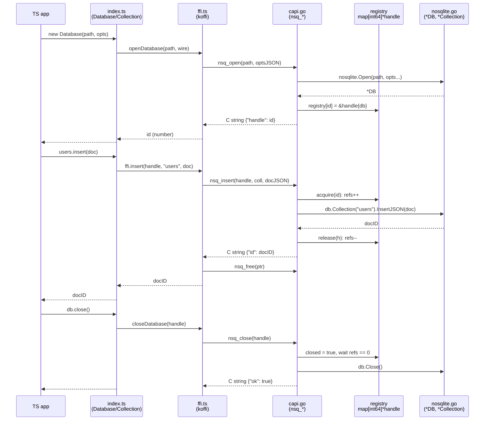

# nosqlite

An embedded document store in Go, in the spirit of SQLite: no server, no daemon,
one file on disk, linked directly into the host process. Callable from Go,
Python and TypeScript.

**New here, or setting up a fresh clone?**
[`docs/getting-started.md`](docs/getting-started.md) is the step-by-step: what to
install, in what order, and how to tell it worked.

**v1 supports insert, query** (filter / sort / skip / limit) **and replace** — the
whole-document overwrite; delete and compaction are still to come. See
[`docs/design.md`](docs/design.md) for the full design,
[`docs/file-format.md`](docs/file-format.md) for what is on disk and how a
collection scans its own records,
[`docs/updates-and-compaction.md`](docs/updates-and-compaction.md) for how replace
works on an append-only file and how delete and compaction will,
[`docs/matcher.md`](docs/matcher.md) for
how filters compile and match, [`docs/testing.md`](docs/testing.md) for how unit,
conformance, and scale tests are organized across the three languages, and
[`docs/nosql-primer.md`](docs/nosql-primer.md) if *collection* and *document* are
new terms. [`docs/todo.md`](docs/todo.md) is the live working list of what is
being built next.

```
./demo.nsq          the database — one file, all collections, copy it anywhere
./demo.nsq.trace    optional human-readable trace of every operation
```

---

## Quick start — Go

```go
db, err := nosqlite.Open("./demo.nsq")
if err != nil { log.Fatal(err) }
defer db.Close()

users, _ := db.Collection("users")
id, _ := users.Insert(map[string]any{"name": "Ada", "age": 36, "tags": []any{"math"}})

docs, _ := users.Find(nosqlite.Query{
    Filter: map[string]any{"age": map[string]any{"$gte": 30}},
    Sort:   []nosqlite.SortKey{{Field: "age", Desc: true}},
    Limit:  10,
})

// Constant memory over any number of matches:
users.ForEach(nosqlite.Query{Filter: map[string]any{"age": map[string]any{"$gte": 30}}},
    func(doc map[string]any) error {
        fmt.Println(doc["name"])
        return nil
    })
```

```sh
make example        # runs examples/basic
```

## Quick start — Python

```sh
make build          # builds python/nosqlite/libnosqlite.so — required first
make example-py     # runs examples/basic/basic.py
```

```python
from nosqlite import Database

with Database("./demo.nsq", trace="all") as db:
    users = db["users"]

    users.insert({"name": "Ada", "age": 36, "tags": ["math"]})
    users.insert_many([{"name": "Grace", "age": 45}, {"name": "Alan", "age": 41}])

    for u in users.find({"age": {"$gte": 40}}, sort=[("age", -1)], limit=10):
        print(u["name"], u["age"])

    print(users.find_one({"name": "Ada"}))    # dict, or None
    print(users.count({"age": {"$gte": 40}})) # 2
    print(len(users))                          # 3
    print(db.collections())                    # ['users']
```

The Python package is a thin `ctypes` wrapper over the shared library.
`find()` applies a **default limit of 1000** and raises if it is actually hit —
use `limit=0` for everything, or `iter_find()` to stream without holding the
whole result in memory.

## Quick start — TypeScript

```sh
make build          # builds the shared library — required first
make example-ts     # installs koffi, then runs examples/basic/basic.ts
```

```ts
import { Database } from "../../typescript/nosqlite/index.ts";

const db = new Database("./demo.nsq", { trace: "all" });
try {
  const users = db.collection("users");

  users.insert({ name: "Ada", age: 36, tags: ["math"] });
  users.insertMany([
    { name: "Grace", age: 45 },
    { name: "Alan", age: 41 },
  ]);

  for (const u of users.find({ age: { $gte: 40 } }, { sort: [["age", -1]], limit: 10 })) {
    console.log(u.name, u.age);
  }

  console.log(users.findOne({ name: "Ada" }));      // object, or null
  console.log(users.count({ age: { $gte: 40 } }));  // 2
  console.log(users.count());                       // 3
  console.log(db.collections());                    // ["users"]
} finally {
  db.close();
}
```

Same library, same JSON convention, same default limit as Python (`limit: 0`
for everything, `iterFind()` to stream). **Every call is synchronous** — the
database is linked into this process, so there is no socket and nothing to
`await`.

Node has no built-in FFI, so the binding loads the library with
[`koffi`](https://koffi.dev) — its one dependency, prebuilt, no compiler
needed. There is no build step for the TypeScript itself: Node ≥ 22.18 strips
the types and runs the source directly. `make ts-check` runs `tsc` when you
want the types actually checked.

---

## Filters

The Mongo dialect, so the same filter works from Go, Python, TypeScript and the
CLI.

| | |
| --- | --- |
| `{"name": "Ada"}` | bare literal means `$eq` |
| `{"age": {"$gte": 30, "$lt": 60}}` | `$eq $ne $gt $gte $lt $lte` |
| `{"name": {"$in": ["Ada", "Alan"]}}` | `$in`, `$nin` |
| `{"address": {"$exists": true}}` | `$exists` |
| `{"address.city": "Oslo"}` | dotted paths reach into nested objects |
| `{"tags": "math"}` | an array matches if **any element** matches |
| `{"$or": [{...}, {...}]}` | `$and`, `$or`, `$not` |

Two behaviours worth knowing:

- **Comparison operators only match within a type.** `{"age": {"$gte": 30}}`
  does not match `{"age": "36"}`. Sorting, by contrast, uses a total order
  across types: `absent < null < numbers < strings < booleans < arrays <
  objects`.
- **An unknown `$operator` is an error**, not a silent no-match. A typo'd
  `$gtee` returning zero rows is the worst possible outcome.

---

## The trace file

Off by default. Two ways to turn it on, and the second is the one you will
actually use:

```go
nosqlite.Open("./demo.nsq", nosqlite.WithTrace(nosqlite.TraceAll))
```

```sh
NOSQLITE_TRACE=all ./myprogram      # no recompile; works from Python and TypeScript too
```

Levels: `off`, `writes`, `all` (adds queries and their scan statistics),
`verbose` (adds document payloads). One line per operation:

```
2026-08-09T14:23:01.455Z  000122  INSERT  users   _id=018f2c…001 off=309200144 len=299   dur=41µs   ok
2026-08-09T14:23:02.101Z  000124  FIND    users   filter={"age":{"$gte":30}} sort=age:desc limit=10 scanned=1000000 matched=41871 returned=10  dur=1.284s  ok
```

`scanned` / `matched` / `returned` is the closest thing to `EXPLAIN QUERY PLAN`
this database has — with no indexes, the ratio between them explains every slow
query. `off=` / `len=` is the exact byte range of the record, so a trace line
leads straight to `nsq dump --from <off>`.

A trace failure never fails an operation, the file is never `fsync`ed, and it
stops at a size cap (64 MB default) rather than filling the disk.

---

## The `nsq` CLI

```sh
make cli

./bin/nsq stat   demo.nsq                     # header, collections, counts, sizes
./bin/nsq dump   demo.nsq --coll users --limit 5
./bin/nsq dump   demo.nsq --from 309200144    # the off= from a trace line
./bin/nsq verify demo.nsq                     # walk every checksum
./bin/nsq find   demo.nsq users '{"age":{"$gte":30}}' --sort age:desc --limit 10
```

`verify` exits non-zero when it finds a bad record, so it works in a script.

---

## What it costs

| | |
| --- | --- |
| Memory | ~12 bytes per document (`offsets` + `lengths`); documents stay on disk |
| 1M documents | ~12 MB of index, ~312 MB of file |
| Open | one sequential read; no JSON parsing during replay |
| Query | a full scan, ~1–3 s per million 300-byte documents, dominated by `encoding/json` |
| Insert | one append plus one `fsync` (`WithSync(SyncNever)` relaxes it) |

A completed `Insert` survives `kill -9`. A crash mid-append leaves a torn
record at the tail, which the next `Open` detects by checksum and truncates
away — that insert never returned success, so losing it is correct. A checksum
failure **not** at the tail is real corruption and `Open` refuses rather than
guessing.

## What it does not do

Updates, deletes, projections, aggregation, secondary indexes, transactions,
multi-document atomicity, networking. **And no multi-process access**: there is
no file lock, so two processes opening the same file will corrupt it. Each of
these has a named extension point in the design doc; §11 there is the ordered
roadmap.

Within one process, `*DB` and `*Collection` are safe for concurrent use.
Queries see a point-in-time snapshot: documents inserted after a query started
are not visible to it.

---

## Numbers are `float64`

JSON has no integer type, so `42` round-trips through Go as `float64(42)`:

```go
age := doc["age"].(float64)   // not int
```

Comparison and sorting treat all numbers as one type, and Python's `json.loads`
hands back `42` as an `int` again — so this is only visible from Go. In
TypeScript every number is a double anyway, so the round trip changes nothing;
document values are typed `unknown`, so narrow with `Number(u.age)`.

---

## Layout

The root directory is the `nosqlite` package itself — in Go the import path *is*
the directory path, so a library's public API lives at the top. Everything that
callers never touch sits under `internal/`, which the compiler refuses to let
any other module import.

```
nosqlite.go        DB, Open, Close, Collection, options
collection.go      Insert, InsertJSON, InsertMany, Replace, Find, FindOne, ForEach, Count
store.go           file header, record framing, append, replay, torn-tail recovery
catalog.go         collection name <-> id
index.go           offsets/lengths arrays, snapshots, lazy _id table
scan.go            streaming scan: sequential vs strided reads, query execution
query.go           Query, SortKey, Matcher — the query engine's public face
trace.go           the trace file
id.go              _id generation

internal/engine/   the query engine, which knows nothing about files or locks
  compile.go       filter document -> Matcher tree
  match.go         Matcher tree: and/or/not/cmp/in/exists, path walking
  compare.go       cross-type total ordering
  sort.go          SortKey, result ordering, bounded heap for sort+limit

cmd/nsq/             inspection CLI
capi/                C ABI (JSON in, JSON out, integer handles)
python/nosqlite/     ctypes wrapper
typescript/nosqlite/ koffi wrapper (ffi.ts) + Database/Collection (index.ts)
examples/basic/      main.go, basic.py, basic.ts — the same tour three times
```

The `internal/engine` split is the one real boundary in the codebase: hand that
package a decoded document and it will tell you whether the document matches and
how it sorts. It never opens a file, takes a lock, or knows a collection exists.

## Low-level call flow (TypeScript → C ABI → Go)

One example per lifecycle stage — Python's `_lib.py` mirrors `ffi.ts` exactly,
same JSON-in/JSON-out convention, so this covers both bindings.



**`new Database(path, opts)` → `nsq_open`**
[index.ts:111-121](typescript/nosqlite/index.ts#L111-L121) ·
[ffi.ts:131-133](typescript/nosqlite/ffi.ts#L131-L133) ·
[capi.go:167-215](capi/capi.go#L167-L215) ·
[nosqlite.go:248](nosqlite.go#L248)

- `index.ts` builds a snake_case `wire` options object (JS is camelCase, the wire format isn't)
- `ffi.ts` `JSON.stringify`s it, calls `nsq_open(path, optsJSON)` through koffi
- `nsq_open` unmarshals the options JSON into `openOptions`, translates each field into a `nosqlite.Option` (`WithSync`, `WithTrace`, ...)
- calls `nosqlite.Open`, which returns `*DB` — a real Go pointer, and it **never crosses the FFI wall**: cgo forbids storing Go pointers in C-owned memory
- instead `capi.go` stashes it: `registry[id] = &handle{db: db}`, where `id` is just a package-level incrementing `int64`
- responds with the JSON `{"handle": id}`, marshaled into a `C.CString` (a heap copy the Go GC doesn't know about)
- `ffi.ts` decodes that string, frees it, parses the JSON, returns `id` as a JS `number`
- `index.ts` stores it in the private field `#handle` — **that integer is the only thing JS ever holds**; the real `*DB` lives entirely on the Go side, keyed by that id

**Every data call — `insert`, `insertMany`, `replace`, `find`, `count`, `collections`**
[ffi.ts:139-157](typescript/nosqlite/ffi.ts#L139-L157) ·
[capi.go:248-397](capi/capi.go#L248-L397)

- same shape every time: `Collection.method()` → `ffi.method(handle, ...)` → `nsq_method(handle, ...)`
- `capi.go` calls `acquire(id)` first: looks up `registry[id]`, errors `invalid handle` / `handle is closed` if it can't proceed, else `refs++`
- `defer release(h)` decrements `refs` on the way out — runs on every return path, including errors and recovered panics
- looks up the collection with `h.db.Collection(name)`, then calls the real method (`InsertJSON`, `Find`, `Count`, `Collections`)
- `nil` Go slices are normalized to `[]` before marshaling, never `null` — so the JS/Python side can always iterate without a null check
- `guard(&out)` — a deferred `recover()` — turns any panic anywhere in the call into `{"error": "nosqlite: panic: ..."}` instead of taking the whole process down

**`close()` → `nsq_close`**
[index.ts:127-134](typescript/nosqlite/index.ts#L127-L134) ·
[capi.go:218-246](capi/capi.go#L218-L246)

- `index.ts` sets `#handle = null` **before** calling `ffi.closeDatabase` — so if the call throws, a second `close()` can't try to double-close the same handle
- `nsq_close` sets `h.closed = true` under `registryMu` first — any `nsq_*` call arriving after this point fails cleanly instead of racing the close
- then blocks on `registryCond.Wait()` until `h.refs == 0` — i.e. any `nsq_insert`/`nsq_find` already in flight *on another thread* gets to finish first
- only then: `delete(registry, id)`, then `h.db.Close()` (flush + close the OS file)

**String ownership, every single call**
[ffi.ts:106-127](typescript/nosqlite/ffi.ts#L106-L127) ·
[capi.go:399-406](capi/capi.go#L399-L406)

- every `nsq_*` return value is built with `C.CString` — a copy on the C heap, invisible to Go's GC, that must be freed exactly once
- koffi functions are declared to return `void *`, not `char *` — with `char *` koffi would auto-copy into a JS string and drop the pointer, leaving nothing to free
- `ffi.ts`'s `call()` wraps every invocation in `try { decode + JSON.parse } finally { nsqFree(ptr) }` so no call site can forget

## Development

Prerequisites and first-build instructions live in
[`docs/getting-started.md`](docs/getting-started.md) — the short version is Go
1.24+, a C compiler, and (per binding) Python 3.9+ or Node 22.18+.

```sh
make test        # go test ./...
make test-race   # the concurrency tests are worth running under -race
make ts-check    # tsc over the TypeScript binding (Node only strips types)
make all         # the above plus the library, the CLI, and all three conformance suites
```

Three files exist purely so an editor sees what the runtime sees, and none of
them affect the build: [`pyrightconfig.json`](pyrightconfig.json) puts `python/`
on Pylance's import path, [`examples/tsconfig.json`](examples/tsconfig.json)
gives the TypeScript language server a config to find above
`examples/basic/basic.ts`, and [`examples/basic/package.json`](examples/basic/package.json)
is two lines declaring that directory ES-module territory. Without them the
examples are full of red underlines that say nothing about the code.

---

## Decisions taken from the design's open questions

- **`Insert` does not mutate the caller's map.** It returns the id; assign it
  yourself if you want it in your own dict.
- **All numbers are `float64`** in the Go API (no `json.Decoder.UseNumber()`),
  documented above rather than worked around.
- **Tracing is off by default**, enabled by `WithTrace` or `NOSQLITE_TRACE`.
- **Sorted results break ties by insertion order**, so a `Sort`+`Limit` query
  returns the same documents in the same order every run.
- **Handle refcounting is in the C ABI from the start**, so `nsq_close` cannot
  free a database out from under an in-flight call on another thread — it waits
  for the call to finish, and calls arriving after the close get a clean error.
  (Design §6 flagged this as cheap now, invasive later.)
