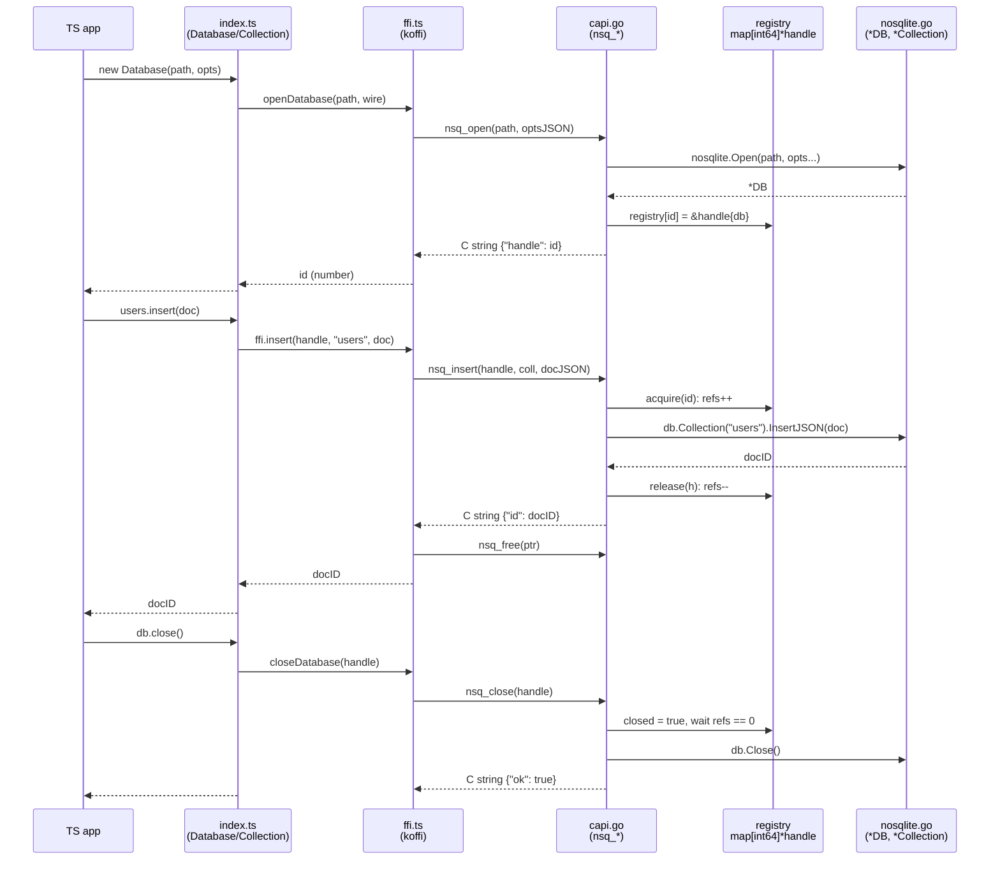

# The bindings — C ABI, Python, TypeScript

How a call in Python or TypeScript reaches Go. `capi/` is `package main` built
with `-buildmode=c-shared`, producing `libnosqlite.so` / `.dylib` / `.dll` plus a
generated header. Both bindings load that same library.

```sh
make build      # required before any Python or TypeScript code works
```

---

## Three rules at the boundary

They exist to make it boring, which is what you want from an FFI boundary.

1. **JSON in, JSON out.** Every argument is a C string of JSON (or a plain string
   for `path`/`coll`), every return is a C string of JSON. One marshalling
   convention, nothing to keep in sync as the API grows.
2. **Never panic across the boundary.** Every export wraps its body in
   `defer recover()` and converts anything — including a Go panic — into
   `{"error": "..."}`. A panic crossing into C is undefined behaviour.
3. **Handles, not pointers.** A `map[int64]*handle` maps opaque integers to
   databases. cgo forbids storing Go pointers in C memory, and an integer handle
   also gives a clean error for use-after-close instead of a segfault.

**The caller must call `nsq_free` on every returned pointer** — `C.CString` is C
heap memory, invisible to the Go GC. This is the one piece of manual discipline
in the design, and both bindings hide it completely.

## The exports

```go
//export nsq_open
func nsq_open(path, optsJSON *C.char) *C.char   // → {"handle":1} | {"error":"..."}
//export nsq_close
func nsq_close(h C.longlong) *C.char            // → {"ok":true}
//export nsq_insert
func nsq_insert(h C.longlong, coll, docJSON *C.char) *C.char        // → {"id":"..."}
//export nsq_insert_many
func nsq_insert_many(h C.longlong, coll, docsJSON *C.char) *C.char  // → {"ids":[...]}
//export nsq_replace
func nsq_replace(h C.longlong, coll, filterJSON, docJSON *C.char) *C.char  // → {"replaced":1}
//export nsq_delete
func nsq_delete(h C.longlong, coll, filterJSON *C.char) *C.char     // → {"deleted":1}
//export nsq_delete_many
func nsq_delete_many(h C.longlong, coll, filterJSON *C.char) *C.char // → {"deleted":n}
//export nsq_find
func nsq_find(h C.longlong, coll, queryJSON *C.char) *C.char        // → {"docs":[...]}
//export nsq_count
func nsq_count(h C.longlong, coll, filterJSON *C.char) *C.char      // → {"count":3}
//export nsq_collections
func nsq_collections(h C.longlong) *C.char                          // → {"names":[...]}
//export nsq_free
func nsq_free(s *C.char)
```

`nsq_delete_many` reports its count *alongside* an error, because it is not
atomic — `n` is how many tombstones actually landed.

**`optsJSON`**: `{"sync":"always"|"never", "trace":"off"|"writes"|"all"|"verbose",
"trace_file":"...", "fast_open":true}`. All optional, may be NULL.

**`filterJSON`**: a bare Mongo-dialect filter. NULL or `""` means the empty
filter, which matches everything — on the two delete exports that is a
collection-emptying operation, so the bindings require the argument rather than
defaulting it.

**`queryJSON`**: the whole query, mirroring Go's `Query` with sort keys spelled
out as objects, which travels better into every language:

```json
{
  "filter":     {"age": {"$gte": 30}},
  "projection": {"name": 1, "address.city": 1},
  "sort":       [{"field": "age", "desc": true}],
  "skip":       0,
  "limit":      10
}
```

Every key is optional; `{}` or NULL is the zero query. `"limit": 0` means no
limit, so a binding's own default limit has to be resolved into a number *before*
the call, not signalled by omitting the key.

**`filter` and `projection` cross as the caller wrote them** and are compiled on
the Go side. That is what "JSON in, JSON out" buys: one grammar, one set of
validation rules, one set of error messages for all three languages. A binding's
whole job is to translate its own idiom into this shape — TypeScript's
`[["age", -1]]` becomes `[{"field": "age", "desc": true}]` — and never to inspect
what is inside a filter. A new operator therefore reaches Python and TypeScript
with **no binding change at all**.

**Memory across the boundary.** `nsq_find` materialises its whole result as one C
string, a second full copy on top of the Go slice that produced it. So the 12 MB
footprint guarantee stops at the ABI: an unlimited `find` over a large collection
is the one way to blow up a process that is otherwise tiny. v1's answer is the
bindings' default `limit` of 1000; the real fix is a batched
`nsq_find_batch`.

---

## Call flow — TypeScript → C ABI → Go

Python's `_lib.py` mirrors `ffi.ts` exactly, so this covers both.



### Open
[index.ts:111-121](../typescript/nosqlite/index.ts#L111-L121) ·
[ffi.ts:131-133](../typescript/nosqlite/ffi.ts#L131-L133) ·
[capi.go:167-215](../capi/capi.go#L167-L215)

- `index.ts` builds a snake_case `wire` options object — JS is camelCase, the
  wire format isn't.
- `nsq_open` unmarshals it, translates each field into a `nosqlite.Option`, and
  calls `nosqlite.Open`.
- The resulting `*DB` **never crosses the FFI wall**. `capi.go` stashes it as
  `registry[id] = &handle{db: db}` and returns `{"handle": id}`.
- **That integer is the only thing JS ever holds.**

### Every data call
[ffi.ts:139-157](../typescript/nosqlite/ffi.ts#L139-L157) ·
[capi.go:248-397](../capi/capi.go#L248-L397)

- Same shape every time: `Collection.method()` → `ffi.method(handle, …)` →
  `nsq_method(handle, …)`.
- `acquire(id)` first — errors `invalid handle` / `handle is closed` if it can't
  proceed, else `refs++`. `defer release(h)` runs on every return path, including
  panics.
- `nil` Go slices are normalised to `[]`, never `null`, so the far side can
  always iterate without a null check.
- `guard(&out)` — a deferred `recover()` — turns any panic into
  `{"error": "nosqlite: panic: ..."}` instead of taking the process down.

### Close
[index.ts:127-134](../typescript/nosqlite/index.ts#L127-L134) ·
[capi.go:218-246](../capi/capi.go#L218-L246)

- `index.ts` sets `#handle = null` **before** calling into the library, so a
  throw cannot leave a second `close()` able to double-close the handle.
- `nsq_close` sets `h.closed = true` under the registry mutex first — any call
  arriving after this point fails cleanly instead of racing the close.
- Then it blocks until `h.refs == 0`, so an `nsq_insert` already in flight *on
  another thread* finishes first. Only then `delete(registry, id)` and
  `h.db.Close()`.

> Refcounting is in the C ABI from the start rather than retrofitted: it is cheap
> to build in when the C layer is written and invasive afterwards.

### String ownership, every single call
[ffi.ts:106-127](../typescript/nosqlite/ffi.ts#L106-L127) ·
[capi.go:399-406](../capi/capi.go#L399-L406)

- Every return value is built with `C.CString` — a copy on the C heap that must
  be freed exactly once.
- **koffi declares the returns as `void *`, not `char *`.** With `char *` koffi
  would auto-copy into a JS string and drop the pointer, leaving nothing to free.
- **ctypes declares `restype` as `c_void_p`, not `c_char_p`**, for exactly the
  same reason: `c_char_p` copies the bytes and discards the address.
- Both wrap every call in `try { decode + parse } finally { free(ptr) }`, so no
  call site can forget.

---

## What each binding adds

Beyond translation, the wrappers own two things the Go API does not need:

- **A cap of 1000 documents on `find`** when the caller sets no limit, raising
  `NoSQLiteError` when 1000 or more match rather than returning a list that has
  been cut off; `limit=0` opts out. The cap exists because the result is
  materialised three times over — Go slice → C string → language list.
- **`iter_find` / `iterFind`**, which page with `skip`/`limit` and yield one
  document at a time, keeping caller-side memory flat. They become the wrapper
  over `nsq_find_batch` once it exists, with no signature change.

The same `.so` would serve Bun's `bun:ffi` or Deno's `Deno.dlopen` — the
JSON-in/JSON-out convention means a third binding is the same shape as these two,
not a new design.

---

## See also

- [`api.md`](api.md) — the surfaces these implement
- [`design.md`](design.md) — the Go engine underneath
- [`getting-started.md`](getting-started.md) — building the library
