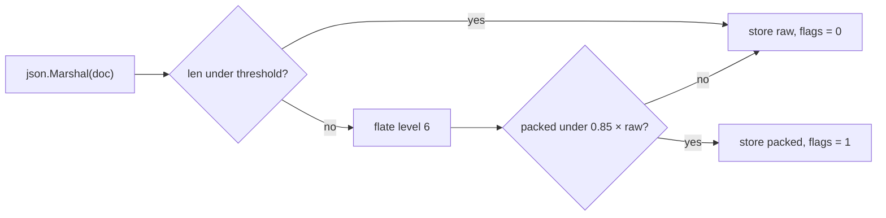

# Compressing document payloads

JSON is redundant — repeated field names, enum-ish strings, whitespace-free but still
verbose — and it compresses very well. This document measures what that would actually
cost nosqlite, and where in the design it would land.

Nothing here is implemented. v1 stores payloads verbatim
([`store.go`](../store.go), [`collection.go`](../collection.go)). This is the note that
says what the trade looks like before anyone reaches for `compress/gzip`.

---

## 1. What was measured

A synthetic document shaped like real application data: a small envelope (`_id`,
timestamps, tenant, status) wrapping a `line_items` array of records with repeated field
names, SKU codes, prices, enum status strings, and short free-text notes. Three sizes:
1 KB, 10 KB, 100 KB.

For each, four numbers:

| number | what it means for nosqlite |
|---|---|
| **ratio** | stored bytes ÷ original bytes — the disk and page-cache win |
| **compress** | added cost on the `Insert` path, [`collection.go:214`](../collection.go#L214) |
| **decompress** | added cost per document scanned, [`scan.go:195`](../scan.go#L195) |
| **`json.Unmarshal`** | the baseline the scan path *already* pays for every document |

The last column is the one that matters. Compression is not free, but it is only worth
worrying about relative to work already being done — and the scan path already parses
every document it touches.

`compress/flate` and `compress/gzip`, stdlib only, consistent with the zero-dependency
rule in [`go.mod`](../go.mod). Go 1.26.5, darwin/arm64. Writers and readers allocated
once and reused via `Reset` (see §6 — this matters more than the codec choice).

---

## 2. Results

| doc size | codec | level | ratio | compress | decompress | `json.Unmarshal` | decompress as % of parse |
|---|---|---|---|---|---|---|---|
| 1 K | flate | 1 | 0.41 | 11.7 µs | 5.9 µs | 11.9 µs | 50% |
| 1 K | flate | 6 | 0.37 | 25.6 µs | 4.5 µs | 11.9 µs | 38% |
| 1 K | flate | 9 | 0.37 | 22.6 µs | 4.1 µs | 11.9 µs | 34% |
| 1 K | gzip | 1 | 0.42 | 8.0 µs | 4.4 µs | 11.9 µs | 37% |
| 10 K | flate | 1 | 0.21 | 21.5 µs | 17.8 µs | 53.0 µs | 34% |
| 10 K | flate | 6 | 0.16 | 50.3 µs | 13.0 µs | 53.0 µs | 25% |
| 10 K | flate | 9 | 0.16 | 65.1 µs | 12.9 µs | 53.0 µs | 24% |
| 10 K | gzip | 1 | 0.21 | 21.7 µs | 18.0 µs | 53.0 µs | 34% |
| 100 K | flate | 1 | 0.18 | 183 µs | 166 µs | 530 µs | 31% |
| 100 K | flate | 6 | 0.12 | 808 µs | 98 µs | 530 µs | 19% |
| 100 K | flate | 9 | 0.12 | 1.93 ms | 100 µs | 530 µs | 19% |
| 100 K | gzip | 1 | 0.18 | 177 µs | 174 µs | 530 µs | 33% |

gzip is flate plus a ~18-byte header and a trailing CRC32. Since every record already
carries its own CRC ([`store.go:33`](../store.go#L33)), gzip's framing is pure duplicate
work — use raw flate.

---

## 3. Reading the numbers

**Decompression is cheap relative to the parse.** It lands at 20–50% of
`json.Unmarshal`, not 200%. A scan that currently costs *X* per document would cost
about *1.3X*, in exchange for reading a fifth to an eighth of the bytes. On a cold cache
that is a straight win — the I/O avoided is worth far more than 100 µs of CPU. On a warm
page cache it is a real, if modest, loss.

**Compression is the expensive direction, and levels above 6 are waste.** Level 9 buys
zero additional ratio over level 6 at every size measured, for up to 2.4x the time
(1.93 ms vs 808 µs at 100 K). If compression happens at all, level 6 is the ceiling.
Level 1 is 4x faster to write and gives up a third of the ratio.

Two results that are not obvious:

**Small documents compress badly.** 0.37 at 1 K against 0.12 at 100 K — same field
names, same shapes. DEFLATE's matcher has to *see* redundancy before it can encode it,
and within a single small document there is barely any history to match against. Below
roughly 500 bytes, compression is often net-negative once stream framing is counted.
This is the strongest argument for the conditional scheme in §4.

**Level 1 decompresses *slower* than level 6.** 166 µs vs 98 µs at 100 K. Cheap
compression settles for emitting literals where a better search would have found a
back-reference; the decoder then has more bytes to copy. "Fast level" is fast for the
writer only. Since a document store reads far more often than it writes, this points the
same way as the level-9 result: **level 6.**

---

## 4. How it would fit the file format

The mechanism is already reserved. The record header
([`store.go:27`](../store.go#L27)) carries a `flags` byte documented as *"zero in v1"*,
written as zero at [`store.go:173`](../store.go#L173) and rejected if nonzero on read at
[`store.go:355`](../store.go#L355).

```
length   uint32    4 bytes   payload length          <- of the STORED bytes
op       uint8     1 byte
flags    uint8     1 byte    <- low nibble: codec. 0 = none, 1 = flate
coll     uint16    2 bytes
crc32    uint32    4 bytes   over op‖flags‖coll‖payload
```

Two properties fall out of that layout for free, and both are good:

- **The CRC covers the stored (compressed) bytes.** Corruption is detected *before* the
  decompressor is handed a garbage stream, which is exactly the right order — a bit-flip
  surfaces as "record N failed its checksum" rather than a `flate: corrupt input`
  somewhere deep in a read loop.
- **`length` and `maxPayloadSize` come to mean stored size**, so the size limit becomes a
  limit on what lands on disk rather than on the document. A document slightly over the
  cap could now fit. That is a semantic change worth deciding on deliberately, not
  drifting into.

### Compress conditionally, per record

Given §3, a single global on/off switch is the wrong shape. Per record:



Try it, keep the result only if it actually won. Small documents and
already-incompressible payloads (embedded base64, random ids) stay raw and pay nothing
but a failed attempt on write; large redundant documents get their 6–8x. The reader
branches on one byte, and a file can hold a mix — which also means the format stays
readable by a build that only understands `flags == 0` documents, as long as it was never
asked to write.

Old files keep working unchanged: every existing record already has `flags == 0`, which
means "raw" under the new scheme too. Only the *reader* needs to learn codec 1 before any
writer emits it.

---

## 5. Where it works against the current design

**The full scan is the problem.** [`scan.go`](../scan.go) has no secondary indexes, so
every query reads and parses every document in the collection, and a non-matching
document is pure waste — the file says as much at
[`scan.go:18`](../scan.go#L18). Compression multiplies that waste: a query that scans a
million documents to return ten now decompresses a million documents.

This does not make compression wrong, but it changes what it argues for. **Compression
and secondary indexes belong together** — with an index, decompression is paid only on
documents that are actually returned, and the 20–50% overhead applies to the result set
instead of the collection.

**It forecloses raw-byte tricks permanently.** Today a payload on disk is JSON, so cheap
pre-filters are available: a `bytes.Contains` screen before parsing, or a lazy partial
parse of just one field — which is exactly what
[`index.go:245`](../index.go#L245) already does to pull `_id` out without decoding the
whole document. Compressed payloads must be fully decompressed before *any* of that
becomes possible. The `_id` extraction on recovery would get strictly more expensive.

**It moves the streaming-memory story slightly.** The scan's peak-memory property
([`scan.go:7`](../scan.go#L7)) survives — decompression is into a reusable scratch
buffer, same as the payload buffer at [`store.go:315`](../store.go#L315) — but a
`flate.Reader` carries a 32 KB window plus internal state, and a `flate.Writer` is
substantially heavier. Those must be allocated once and `Reset` per record, never per
document (§6).

---

## 6. The measurement trap worth remembering

The first version of this benchmark allocated a fresh `flate.Writer` per document and
reported 47 µs to compress a 1 KB document. The real number is 25 µs. `flate.NewWriter`
allocates a large hash-chain table for the match search; at level 6 that allocation alone
costs more than compressing a small document.

```go
// wrong: ~40µs of allocation per document, before any compression happens
w, _ := flate.NewWriter(&buf, 6)

// right: allocate once, Reset per document
w.Reset(&buf)

// readers too — flate.Reader hides Reset behind an interface assertion
r.(flate.Resetter).Reset(bytes.NewReader(packed), nil)
```

`flate.NewReader` returns an `io.ReadCloser`, not a concrete type, so the reset method is
only reachable through the `flate.Resetter` interface — a small piece of Go API design
that is easy to miss and that turns a 5 µs operation into a 40 µs one if missed.

Any real implementation wants a `sync.Pool` of writers and readers, or one of each pinned
per `DB` under the existing write lock.

---

## 7. What would change these numbers

**A shared dictionary** (`flate.NewWriterDict`, still stdlib) is the biggest available
win and the one most specific to a document store. The redundancy in a JSON collection is
mostly *across* documents — every record in `users` repeats the same field names — and
per-record compression cannot see any of it. Priming the window with a dictionary of
common keys should move the 1 K ratio from 0.37 toward ~0.15, i.e. it fixes precisely the
case §3 identified as weakest.

The cost is that the dictionary becomes part of the file format: it must be stored in the
file, versioned, and never changed for existing records. That is a meaningful step up in
format complexity from a single flags nibble.

**zstd or s2** (`github.com/klauspost/compress`) decompress roughly 3–10x faster than
flate at equal or better ratios, which would drop the "% of parse" column into single
digits and make the read-path objection in §5 largely disappear. That is the
technically correct answer and it is unavailable: stdlib-only is a stated goal of the
design ([`design.md` §1](design.md)), not an accident. Reopening it is a project
decision, not a compression decision.

---

## 8. The other axis — binary encoding, and what SQLite's JSONB actually is

The name invites the assumption that JSONB is compression. It is not. SQLite 3.45 (2024)
added it as a second *representation* of the same JSON value, and it is worth understanding
precisely because it attacks the cost this document keeps measuring against — the
`json.Unmarshal` baseline — rather than the byte count.

Every element becomes a header plus a payload:

```
┌──────────┬──────────┬─────────────────────────────┐
│ 4 bits   │ 4 bits   │ payload                     │
│ type     │ size     │ raw bytes, no transform     │
└──────────┴──────────┴─────────────────────────────┘

type   0 NULL   1 TRUE   2 FALSE   3 INT   4 INT5   5 FLOAT  6 FLOAT5
       7 TEXT   8 TEXTJ  9 TEXT5  10 TEXTRAW       11 ARRAY 12 OBJECT

size   0..11 = payload length directly
       12/13/14/15 = length lives in the next 1/2/4/8 bytes, big-endian
```

An array payload is its children concatenated; an object is alternating label, value,
label, value. Three things are deliberately *not* done:

- **Field names are not deduplicated.** `"unit_price"` appears once per line item, same as
  in the text. No dictionary, no interning.
- **Numbers stay ASCII.** `{"quantity":500}` keeps the bytes `500`, not an int64. There is
  no number parsing on write and no formatting on read.
- **Key order is preserved and nothing is sorted**, so the transform is lossless and cheap
  in both directions.

Net size change is therefore roughly nil — quotes, colons and commas come off, header bytes
go on. **JSONB buys exactly one thing: the length in the header lets a reader skip an entire
subtree without looking inside it.**

```
text JSON   finding "status" means walking every byte, tracking brace
            depth, bracket depth, and escaped quotes on the way

JSONB       read a label, compare, and on a miss jump `size` bytes to
            land precisely on the next label
```

Note what that is *not*: there is no offset table and no sorted keys, so a key lookup is
still a linear walk over an object's labels. The walk is just far cheaper per step than
character-level parsing.

### It is not Postgres's `jsonb`, despite the name

| | SQLite JSONB | Postgres `jsonb` | BSON |
|---|---|---|---|
| keys sorted / deduped | no | yes | no |
| key lookup | linear over labels | binary search via per-object offset array | linear |
| numbers | ASCII text | `numeric` | typed binary |
| key order preserved | yes | no | yes |
| built-in compression | **none** | TOAST (lz4 / pglz), a separate layer | snappy / zstd, in WiredTiger |

Postgres pays a normalize-on-write cost to get binary search; SQLite refuses that cost and
keeps the conversion nearly free. The last row is the real answer to "is it compression":
in both Postgres and Mongo the compression is a *different layer underneath*. Binary
encoding and compression are orthogonal, and the mature engines do both.

One caveat if the idea is ever borrowed: SQLite documents the format but does not commit to
it as an interchange format. A file format that adopts it is adopting a snapshot of it.

### How it would land here — and why it argues against §4

Mechanically it costs the same reservation as compression: another codec value in the flags
nibble (§4), `2 = jsonb`, with the same per-record mix and the same backward compatibility.
Everything else is different.

- **It attacks the baseline instead of adding to it.** [`scan.go:195`](../scan.go#L195)
  unmarshals into `map[string]any` for every document, then discards it if `Match` says no
  — 53 µs per 10 K document to answer a question that usually touches two fields. Over a
  length-prefixed payload a matcher can interrogate fields in place and never materialize
  the map at all. flate adds 13 µs on top of that 53; this is aimed at the 53.
- **It makes the `_id` probe genuinely lazy.** [`index.go:247`](../index.go#L247) unmarshals
  into a one-field struct, which is cheap in allocations but still walks the whole document
  looking for `_id`. Skipping subtrees by length would make recovery cost proportional to
  the envelope, not the document.
- **It preserves the raw-byte tricks that §5 says compression forecloses** — the pre-filter
  objection reverses sign here.
- **It gives up the entire disk win.** Nothing in §2's ratio column survives. Cold-cache I/O
  is untouched, which is flate's strongest argument.

So the two sit on different axes, and they compose in one order only: encode, then compress.
That order also destroys the in-place matching, because compression is the outer layer and
must be undone first. **Pick one per record, not both.**

The honest cost is effort. `json.Unmarshal` is free and already correct; a binary encoder,
decoder, and a `Matcher` implementation that walks encoded bytes instead of
`map[string]any` are all code that has to be written, fuzzed, and kept in sync with the
text path. flate is thirty lines. This is not thirty lines — and unlike §2, none of it is
measured here.

---

## Appendix — the harness

Standalone `main.go`, no test framework, run with `go run .`:

```go
package main

import (
	"bytes"
	"compress/flate"
	"compress/gzip"
	"encoding/json"
	"fmt"
	"io"
	"math/rand"
	"time"
)

// makeDoc builds a JSON document of roughly the requested size that looks like
// real application data: repeated field names, enum-ish strings, some free text.
func makeDoc(targetBytes int) []byte {
	rng := rand.New(rand.NewSource(42))
	statuses := []string{"active", "pending", "archived", "suspended"}
	words := []string{"customer", "invoice", "shipment", "north", "region",
		"priority", "review", "quarter", "pending approval", "escalated"}

	type item struct {
		SKU      string  `json:"sku"`
		Name     string  `json:"name"`
		Qty      int     `json:"quantity"`
		Price    float64 `json:"unit_price"`
		Status   string  `json:"status"`
		Notes    string  `json:"notes"`
		Warehse  string  `json:"warehouse_code"`
		Currency string  `json:"currency"`
	}
	doc := map[string]any{
		"_id":        "01J8ZQ4K3F7X2N9V",
		"created_at": "2026-08-11T09:14:22Z",
		"updated_at": "2026-08-11T09:14:22Z",
		"tenant_id":  "acme-corp",
		"status":     "active",
	}
	var items []item
	for len(mustJSON(doc, items)) < targetBytes {
		items = append(items, item{
			SKU:      fmt.Sprintf("SKU-%06d", rng.Intn(999999)),
			Name:     words[rng.Intn(len(words))] + " " + words[rng.Intn(len(words))],
			Qty:      rng.Intn(500),
			Price:    float64(rng.Intn(100000)) / 100,
			Status:   statuses[rng.Intn(len(statuses))],
			Notes: words[rng.Intn(len(words))] + " " + words[rng.Intn(len(words))] +
				" " + words[rng.Intn(len(words))],
			Warehse:  fmt.Sprintf("WH-%02d", rng.Intn(20)),
			Currency: "USD",
		})
	}
	return mustJSON(doc, items)
}

func mustJSON(base map[string]any, items any) []byte {
	m := map[string]any{}
	for k, v := range base {
		m[k] = v
	}
	m["line_items"] = items
	b, err := json.Marshal(m)
	if err != nil {
		panic(err)
	}
	return b
}

func timeIt(iters int, f func()) time.Duration {
	for i := 0; i < 3; i++ { // warm up
		f()
	}
	start := time.Now()
	for i := 0; i < iters; i++ {
		f()
	}
	return time.Since(start) / time.Duration(iters)
}

func main() {
	fmt.Printf("%-8s %-10s %-8s %-6s %12s %12s %12s %12s\n",
		"size", "codec", "level", "ratio", "compress", "decompress",
		"json.Unmar", "roundtrip%")
	for _, size := range []int{1024, 10 * 1024, 100 * 1024} {
		src := makeDoc(size)

		// baseline: the parse the scan path already pays for every document
		var scratch map[string]any
		parseNs := timeIt(2000, func() {
			scratch = nil
			_ = json.Unmarshal(src, &scratch)
		})

		type codec struct {
			name  string
			level int
		}
		codecs := []codec{
			{"flate", flate.BestSpeed},
			{"flate", 6},
			{"flate", flate.BestCompression},
			{"gzip", gzip.BestSpeed},
		}
		for _, c := range codecs {
			var buf bytes.Buffer
			// Writers are allocated ONCE and Reset per document — see §6.
			fw, _ := flate.NewWriter(&buf, c.level)
			gw, _ := gzip.NewWriterLevel(&buf, c.level)
			mk := func() {
				buf.Reset()
				if c.name == "gzip" {
					gw.Reset(&buf)
					gw.Write(src)
					gw.Close()
				} else {
					fw.Reset(&buf)
					fw.Write(src)
					fw.Close()
				}
			}
			compNs := timeIt(500, mk)
			mk()
			packed := append([]byte(nil), buf.Bytes()...)

			out := bytes.NewBuffer(make([]byte, 0, len(src)))
			fr := flate.NewReader(bytes.NewReader(packed))
			gr, _ := gzip.NewReader(bytes.NewReader(packed))
			decNs := timeIt(2000, func() {
				out.Reset()
				if c.name == "gzip" {
					gr.Reset(bytes.NewReader(packed))
					io.Copy(out, gr)
				} else {
					fr.(flate.Resetter).Reset(bytes.NewReader(packed), nil)
					io.Copy(out, fr)
				}
			})

			ratio := float64(len(packed)) / float64(len(src))
			overhead := 100 * float64(decNs) / float64(parseNs)
			fmt.Printf("%-8s %-10s %-8d %-6.2f %12s %12s %12s %11.0f%%\n",
				fmt.Sprintf("%dK", len(src)/1024), c.name, c.level, ratio,
				compNs, decNs, parseNs, overhead)
		}
		fmt.Println()
	}
}
```

Ratios are highly sensitive to document content — rerun against real payloads before
committing to a threshold in §4.
