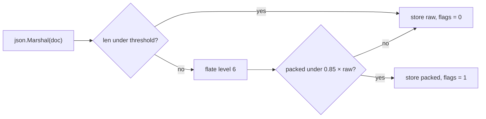

# Compressing document payloads

**Measured, not built.** v1 stores payloads verbatim. This is the note that says
what the trade looks like before anyone reaches for `compress/gzip`.

**The verdict:** flate level 6, per record, only when it actually wins — and not
before secondary indexes exist, because a full scan would decompress a million
documents to return ten.

---

## The numbers

A synthetic document shaped like real application data: a small envelope
wrapping a `line_items` array with repeated field names, SKU codes, prices, enum
strings and short free text. `compress/flate` and `compress/gzip`, stdlib only,
Go 1.26.5, darwin/arm64, writers and readers reused via `Reset`.

| doc size | codec | level | ratio | compress | decompress | `json.Unmarshal` | decompress as % of parse |
|---|---|---|---|---|---|---|---|
| 1 K | flate | 1 | 0.41 | 11.7 µs | 5.9 µs | 11.9 µs | 50% |
| 1 K | flate | 6 | 0.37 | 25.6 µs | 4.5 µs | 11.9 µs | 38% |
| 1 K | flate | 9 | 0.37 | 22.6 µs | 4.1 µs | 11.9 µs | 34% |
| 1 K | gzip | 1 | 0.42 | 8.0 µs | 4.4 µs | 11.9 µs | 37% |
| 10 K | flate | 1 | 0.21 | 21.5 µs | 17.8 µs | 53.0 µs | 34% |
| 10 K | flate | 6 | 0.16 | 50.3 µs | 13.0 µs | 53.0 µs | 25% |
| 10 K | flate | 9 | 0.16 | 65.1 µs | 12.9 µs | 53.0 µs | 24% |
| 10 K | gzip | 1 | 0.21 | 21.7 µs | 18.0 µs | 53.0 µs | 34% |
| 100 K | flate | 1 | 0.18 | 183 µs | 166 µs | 530 µs | 31% |
| 100 K | flate | 6 | 0.12 | 808 µs | 98 µs | 530 µs | 19% |
| 100 K | flate | 9 | 0.12 | 1.93 ms | 100 µs | 530 µs | 19% |
| 100 K | gzip | 1 | 0.18 | 177 µs | 174 µs | 530 µs | 33% |

The last column is the one that matters: the scan path already parses every
document it touches, so compression is only worth judging against work already
being done.

## What the numbers say

- **Decompression is cheap relative to the parse** — 20–50% of `json.Unmarshal`,
  not 200%. A scan would cost ~1.3× per document in exchange for reading a fifth
  to an eighth of the bytes. A straight win on a cold cache, a modest loss on a
  warm one.
- **Levels above 6 are waste.** Level 9 buys zero additional ratio at every size
  measured, for up to 2.4× the time.
- **Small documents compress badly** — 0.37 at 1 K against 0.12 at 100 K, same
  shapes. DEFLATE has to *see* redundancy before it can encode it, and a small
  document has barely any history to match against. Below ~500 bytes it is often
  net-negative once framing is counted.
- **Level 1 decompresses *slower* than level 6** (166 µs vs 98 µs at 100 K).
  Cheap compression settles for literals where a better search would have found a
  back-reference, leaving the decoder more bytes to copy. "Fast level" is fast for
  the writer only — and a document store reads far more than it writes.
- **Use raw flate, not gzip.** gzip is flate plus a header and a trailing CRC32,
  and every record already carries its own CRC.

## How it would fit the format

The mechanism is already reserved: the record header's `flags` byte is written as
zero and validated as zero, so the low nibble becomes the codec — `0 = none`,
`1 = flate`. Old files keep working unchanged, since every existing record
already says "raw".

Two properties fall out for free:

- **The CRC covers the stored (compressed) bytes**, so corruption surfaces as
  "record N failed its checksum" rather than `flate: corrupt input` deep in a
  read loop.
- **`length` comes to mean stored size**, so the size cap becomes a limit on what
  lands on disk rather than on the document. A semantic change worth deciding
  deliberately rather than drifting into.

**Compress conditionally, per record** — a global switch is the wrong shape given
the small-document result:



Try it, keep the result only if it won. Small and already-incompressible payloads
stay raw and pay only a failed attempt on write; large redundant documents get
their 6–8×. A file can hold a mix, and the reader branches on one byte.

## Where it works against the current design

- **The full scan is the problem.** Every query reads and parses every document,
  so compression multiplies the waste: a query scanning a million documents to
  return ten would decompress a million. **Compression and secondary indexes
  belong together** — with an index, decompression is paid on the result set
  instead of the collection.
- **It forecloses raw-byte tricks permanently.** Today a payload on disk is JSON,
  so a `bytes.Contains` pre-filter or a partial parse of one field is available —
  which is exactly what the `_id` probe already does. Compressed payloads must be
  fully decompressed before any of that is possible.
- **Readers and writers must be pooled.** A `flate.Reader` carries a 32 KB window
  and a `flate.Writer` is much heavier; allocate once and `Reset` per record.

> **The measurement trap.** The first version of this benchmark allocated a fresh
> `flate.Writer` per document and reported 47 µs for a 1 KB document. The real
> number is 25 µs — `flate.NewWriter` allocates a large hash-chain table, which at
> level 6 costs more than compressing a small document. Readers hide `Reset`
> behind an interface: `r.(flate.Resetter).Reset(bytes.NewReader(packed), nil)`.

## What would change these numbers

- **A shared dictionary** (`flate.NewWriterDict`, still stdlib) is the biggest
  available win and the most specific to a document store: the redundancy in a
  JSON collection is mostly *across* documents, which per-record compression
  cannot see. It should move the 1 K ratio from 0.37 toward ~0.15 — precisely the
  weakest case. The cost is that the dictionary becomes part of the file format:
  stored, versioned, and never changed for existing records.
- **zstd or s2** decompress 3–10× faster than flate at equal or better ratios,
  which would drop the "% of parse" column into single digits. That is the
  technically correct answer and it is unavailable: stdlib-only is a stated goal,
  not an accident. Reopening it is a project decision, not a compression one.

---

## The other axis — binary encoding

The name invites the assumption that SQLite's JSONB is compression. It is not: it
is a second *representation* of the same value, and it attacks the
`json.Unmarshal` baseline rather than the byte count.

Every element becomes a header plus a payload:

```
┌──────────┬──────────┬─────────────────────────────┐
│ 4 bits   │ 4 bits   │ payload                     │
│ type     │ size     │ raw bytes, no transform     │
└──────────┴──────────┴─────────────────────────────┘

size   0..11 = payload length directly
       12/13/14/15 = length lives in the next 1/2/4/8 bytes, big-endian
```

Field names are **not** deduplicated, numbers stay ASCII, key order is preserved.
Net size change is roughly nil — quotes and commas come off, header bytes go on.
**JSONB buys exactly one thing: the length in the header lets a reader skip an
entire subtree without looking inside it.** There is no offset table and no
sorted keys, so a key lookup is still a linear walk — just far cheaper per step
than character-level parsing.

| | SQLite JSONB | Postgres `jsonb` | BSON |
|---|---|---|---|
| keys sorted / deduped | no | yes | no |
| key lookup | linear over labels | binary search via offset array | linear |
| numbers | ASCII text | `numeric` | typed binary |
| key order preserved | yes | no | yes |
| built-in compression | **none** | TOAST, a separate layer | snappy / zstd, underneath |

That last row is the real answer to "is it compression": in both Postgres and
Mongo the compression is a *different layer underneath*. The two are orthogonal,
and mature engines do both.

**Why it argues against compressing here.** Mechanically it costs the same
reservation — codec `2 = jsonb` in the same flags nibble. Everything else differs:

- **It attacks the baseline instead of adding to it.** The scan unmarshals into
  `map[string]any` for every document and discards it if the filter says no — 53 µs
  per 10 K document to answer a question that usually touches two fields. Over a
  length-prefixed payload a matcher can interrogate fields in place and never
  materialise the map. flate adds 13 µs on top of that 53; this is aimed at the 53.
- **It makes the `_id` probe genuinely lazy** — skipping subtrees by length would
  make recovery cost proportional to the envelope, not the document.
- **It preserves the raw-byte tricks** compression forecloses.
- **It gives up the entire disk win.** Cold-cache I/O is untouched, which is
  flate's strongest argument.

They compose in one order only — encode, then compress — and that order destroys
the in-place matching, because compression is the outer layer and must be undone
first. **Pick one per record, not both.**

The honest cost is effort. `json.Unmarshal` is free and already correct; a binary
encoder, decoder, and a `Matcher` that walks encoded bytes are all code that has
to be written, fuzzed, and kept in sync with the text path. flate is thirty lines.
This is not thirty lines — and unlike the table above, none of it is measured.

---
## Appendix — the harness

Standalone `main.go`, no test framework, run with `go run .`:

```go
package main

import (
	"bytes"
	"compress/flate"
	"compress/gzip"
	"encoding/json"
	"fmt"
	"io"
	"math/rand"
	"time"
)

// makeDoc builds a JSON document of roughly the requested size that looks like
// real application data: repeated field names, enum-ish strings, some free text.
func makeDoc(targetBytes int) []byte {
	rng := rand.New(rand.NewSource(42))
	statuses := []string{"active", "pending", "archived", "suspended"}
	words := []string{"customer", "invoice", "shipment", "north", "region",
		"priority", "review", "quarter", "pending approval", "escalated"}

	type item struct {
		SKU      string  `json:"sku"`
		Name     string  `json:"name"`
		Qty      int     `json:"quantity"`
		Price    float64 `json:"unit_price"`
		Status   string  `json:"status"`
		Notes    string  `json:"notes"`
		Warehse  string  `json:"warehouse_code"`
		Currency string  `json:"currency"`
	}
	doc := map[string]any{
		"_id":        "01J8ZQ4K3F7X2N9V",
		"created_at": "2026-08-11T09:14:22Z",
		"updated_at": "2026-08-11T09:14:22Z",
		"tenant_id":  "acme-corp",
		"status":     "active",
	}
	var items []item
	for len(mustJSON(doc, items)) < targetBytes {
		items = append(items, item{
			SKU:      fmt.Sprintf("SKU-%06d", rng.Intn(999999)),
			Name:     words[rng.Intn(len(words))] + " " + words[rng.Intn(len(words))],
			Qty:      rng.Intn(500),
			Price:    float64(rng.Intn(100000)) / 100,
			Status:   statuses[rng.Intn(len(statuses))],
			Notes: words[rng.Intn(len(words))] + " " + words[rng.Intn(len(words))] +
				" " + words[rng.Intn(len(words))],
			Warehse:  fmt.Sprintf("WH-%02d", rng.Intn(20)),
			Currency: "USD",
		})
	}
	return mustJSON(doc, items)
}

func mustJSON(base map[string]any, items any) []byte {
	m := map[string]any{}
	for k, v := range base {
		m[k] = v
	}
	m["line_items"] = items
	b, err := json.Marshal(m)
	if err != nil {
		panic(err)
	}
	return b
}

func timeIt(iters int, f func()) time.Duration {
	for i := 0; i < 3; i++ { // warm up
		f()
	}
	start := time.Now()
	for i := 0; i < iters; i++ {
		f()
	}
	return time.Since(start) / time.Duration(iters)
}

func main() {
	fmt.Printf("%-8s %-10s %-8s %-6s %12s %12s %12s %12s\n",
		"size", "codec", "level", "ratio", "compress", "decompress",
		"json.Unmar", "roundtrip%")
	for _, size := range []int{1024, 10 * 1024, 100 * 1024} {
		src := makeDoc(size)

		// baseline: the parse the scan path already pays for every document
		var scratch map[string]any
		parseNs := timeIt(2000, func() {
			scratch = nil
			_ = json.Unmarshal(src, &scratch)
		})

		type codec struct {
			name  string
			level int
		}
		codecs := []codec{
			{"flate", flate.BestSpeed},
			{"flate", 6},
			{"flate", flate.BestCompression},
			{"gzip", gzip.BestSpeed},
		}
		for _, c := range codecs {
			var buf bytes.Buffer
			// Writers are allocated ONCE and Reset per document — see §6.
			fw, _ := flate.NewWriter(&buf, c.level)
			gw, _ := gzip.NewWriterLevel(&buf, c.level)
			mk := func() {
				buf.Reset()
				if c.name == "gzip" {
					gw.Reset(&buf)
					gw.Write(src)
					gw.Close()
				} else {
					fw.Reset(&buf)
					fw.Write(src)
					fw.Close()
				}
			}
			compNs := timeIt(500, mk)
			mk()
			packed := append([]byte(nil), buf.Bytes()...)

			out := bytes.NewBuffer(make([]byte, 0, len(src)))
			fr := flate.NewReader(bytes.NewReader(packed))
			gr, _ := gzip.NewReader(bytes.NewReader(packed))
			decNs := timeIt(2000, func() {
				out.Reset()
				if c.name == "gzip" {
					gr.Reset(bytes.NewReader(packed))
					io.Copy(out, gr)
				} else {
					fr.(flate.Resetter).Reset(bytes.NewReader(packed), nil)
					io.Copy(out, fr)
				}
			})

			ratio := float64(len(packed)) / float64(len(src))
			overhead := 100 * float64(decNs) / float64(parseNs)
			fmt.Printf("%-8s %-10s %-8d %-6.2f %12s %12s %12s %11.0f%%\n",
				fmt.Sprintf("%dK", len(src)/1024), c.name, c.level, ratio,
				compNs, decNs, parseNs, overhead)
		}
		fmt.Println()
	}
}
```

Ratios are highly sensitive to document content — rerun against real payloads before
committing to a threshold in §4.
