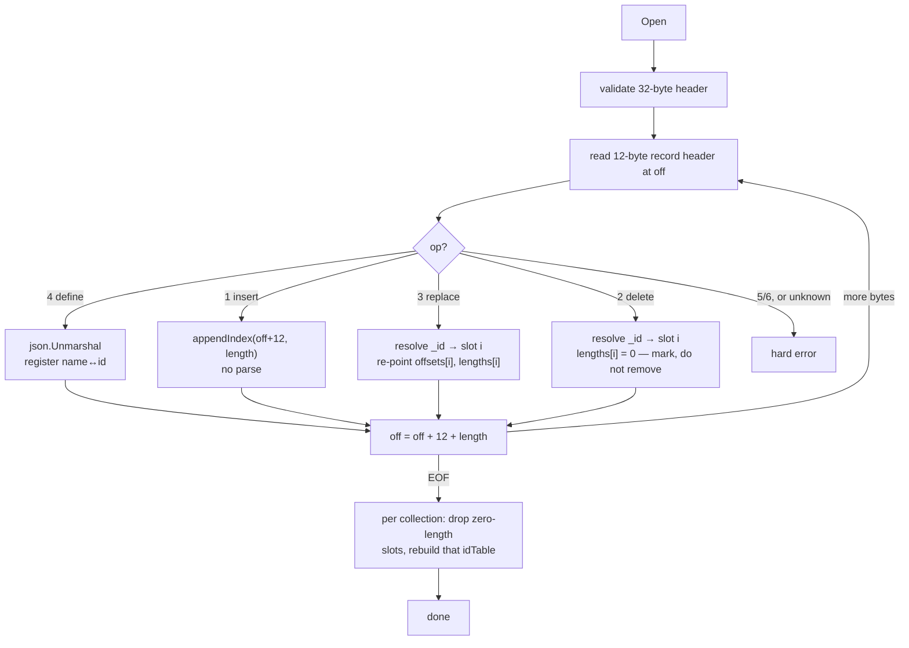

# The file format

What is on disk, and how a collection finds its own documents among everybody
else's — [`store.go`](../store.go), [`catalog.go`](../catalog.go),
[`index.go`](../index.go), [`scan.go`](../scan.go).

**The file has no structure beyond "a header, then records back-to-back".** Every
question about ordering, membership or traversal is answered by reading it start
to finish once, at `Open`.

```
byte 0                    32
  +-------------------+   +--------+--------+--------+--------+ ... EOF
  |   file header     |   | record | record | record | record |
  |     32 bytes      |   +--------+--------+--------+--------+
  +-------------------+
```

No index block, no free list, no page directory, no footer. Records are appended
in write order and never moved, rewritten or padded.

---

## File header — 32 bytes, written once

| offset | size | field | notes |
|---|---|---|---|
| 0 | 8 | magic `"NSQLITE\n"` | opening a JPEG gives *"not a nosqlite file"*, not a parse error |
| 8 | 2 | `format` u16 | bumped only when the layout changes incompatibly |
| 10 | 2 | `flags` u16 | zero in v1, **validated** as zero |
| 12 | 8 | `created` u64 | Unix nanoseconds |
| 20 | 12 | reserved | zero, and validated as zero |

Validating the reserved bytes is what lets a future version claim them without
ambiguity: a file where they are non-zero was written by something newer, and
today's binary refuses it instead of guessing.

## Record — 12-byte header, then exactly `length` payload bytes

The numbers along the top are **boundaries**, not indices — a field spans from
its own marker to the next:

```
   0            4    5    6            8                       12                 12+length
   +------------+----+----+------------+-----------------------+------------------+
   |   length   | op |flag|    coll    |         crc32         |     payload      |
   |    u32     | u8 | u8 |    u16     |          u32          |  `length` bytes  |
   +------------+----+----+------------+-----------------------+------------------+
    little-endian                        CRC covers bytes 4-7 (op‖flags‖coll)
                                         followed by the payload
```

| field | bytes | why it exists |
|---|---|---|
| `length` | 0-3 | **the traversal primitive** — see below |
| `op` | 4 | which operation this record is |
| `flags` | 5 | zero in v1, validated. First claim will probably be a compression bit |
| `coll` | 6-7 | which collection owns it. **This is what makes one file work** |
| `crc32` | 8-11 | distinguishes *corrupt* from *torn* — the whole recovery story rests on it |
| payload | 12.. | JSON |

| op | record | payload |
|---|---|---|
| 1 | insert | the whole document |
| 2 | delete tombstone | `{"_id":"…"}` |
| 3 | replace | the whole new document |
| 4 | define collection | `{"id":7,"name":"users"}` |
| 5 / 6 | begin / commit | **reserved** — multi-document atomicity |

**An unknown or reserved `op` is a hard error on read, never a skip.** An old
binary meeting a file with delete records fails loudly instead of silently
serving deleted documents. Skipping would be the friendlier-looking choice and
the wrong one.

The CRC covers `op‖flags‖coll‖payload` — **not `length`**. That gap is documented
at [store.go:342](../store.go#L342): bit rot in a mid-file length field is
indistinguishable from a torn tail, and gets treated as one. Closing it means a
format bump.

---

## `length` is the link

There is no `next` pointer. The record is self-delimiting, so knowing where it
starts and how long its payload is tells you exactly where the next one starts:

```go
recEnd := off + recordHeaderSize + int64(length)
off = recEnd
```

**A bad `length` is detectable; a bad pointer is not.** `length` is bounds-checked
against the file size and the payload is then CRC-verified. A corrupt `next`
would land on an arbitrary offset that might well *look* like a plausible record
header, with no way to tell. (Pointers also buy cheap splicing, which an
append-only file has no use for, and cost 8 bytes per record restating what is
already there.)

**What it costs:** framing is strictly forward-only. You cannot walk backwards or
jump to record N without walking to it. Random access goes through the in-memory
index instead, and that index is built by exactly one forward walk.

---

## Replay: the file's structure becomes memory, once

[`replay`](../store.go#L307), called by `Open`, is the only full read of the file
in normal operation.



Three properties make this cheap enough to do on every open:

- **Inserts are not unmarshalled.** Replay records *where the payload is and how
  long it is* and moves on. The only JSON parsed is the handful of
  define-collection records — until a collection's first replace or delete, which
  needs `_id` resolution ([`records.md`](records.md)).
- **One pass builds every collection's index.** The `coll` tag routes each record
  as it goes by.
- **The offset stored is the payload's, not the header's** (`off+12`), so a later
  read is one `ReadAt` of exactly the JSON bytes.

`WithFastOpen()` skips the CRC pass and `Discard`s payloads instead of reading
them, checking only the final record so torn-tail recovery still works. Faster,
and weaker: mid-file bit rot then goes unnoticed until something reads that
record.

### Torn tail

Appends are the only writes, so damage can only ever be at the end. That makes
recovery a two-case rule, not a repair algorithm:

| condition | at EOF | mid-file |
|---|---|---|
| short header / short payload | truncate, open succeeds | can't happen |
| `length` exceeds remaining file | truncate, open succeeds | (indistinguishable — see the CRC note above) |
| CRC mismatch | truncate, open succeeds | `ErrCorrupt`, refuse to open |

[`truncateTail`](../store.go#L612) cuts back to the end of the last good record
and returns `nil` — a torn tail after a crash is *expected*, not an error. The
in-flight insert is lost, which is correct: it never returned success.

---

## Interleaving: one file, many collections

Records from every collection share one append point, so a real file looks like
this:

```
off:     32      68      105     404     510     642
       +-------+-------+-------+-------+-------+-------+
       | def   | def   | ins   | ins   | ins   | ins   |
       | id=1  | id=2  | c=1   | c=2   | c=1   | c=1   |
       | users | orders| Ada   | ord-1 | Grace | Alan  |
       +-------+-------+-------+-------+-------+-------+
         users ──┐               ┌───────────────┘
                 └───────────────┴─── one collection, three non-adjacent records
```

**Exactly one append point in the whole database**, guarded by one write lock, so
writes to `users` and `orders` serialise. For an embedded store that is close to
irrelevant — the `fsync` dominates by orders of magnitude — and it is the price
of the database being one artifact you can copy, diff or attach to a bug report.

A sequential read becomes a forward-only strided one. At ~300-byte documents
against 4 KB pages, a couple of interleaved collections still mostly land on
pages the OS readahead already fetched; heavy interleaving is what
[`Compact`](compaction.md) fixes.

### The catalog record

The name `"users"` appears **once**, in an `op=4` record whose payload is
`{"id":1,"name":"users"}`. Every subsequent record carries the 2-byte id
([`catalog.go`](../catalog.go)). Four things fall out of spending a record on it:

- collection ids stay stable across restarts,
- a collection with **zero documents** still exists after reopening,
- `Collections()` is answered from memory with no I/O,
- the name is not repeated a million times.

Ids are assigned sequentially from 1; id 0 is never valid, which is what makes
the "all 65535 ids taken" wrap check work.

---

## How a collection iterates its documents

Not by following anything on disk. The iterator is two slices in memory — 12
bytes per document, insertion order, pointer-free so the GC never walks them:

```go
type Collection struct {
    offsets []int64   // byte offset of each payload
    lengths []uint32  // payload length
}
```

A scan takes a [`snapshot`](../index.go#L96) under the read lock — the few
nanoseconds it takes to copy two slice headers, the file handle and the file
size — then runs the whole scan with **no lock held**, because the bytes it
refers to can never change.

| | [`scanSequential`](../scan.go#L70) | [`scanStrided`](../scan.go#L127) |
|---|---|---|
| chosen when | collection holds ≥ 40% of the file's inserts | collection is a small tenant of a big file |
| uses the index? | **no** — re-reads headers and filters on `coll` | yes — one `ReadAt` per entry |
| bytes read | the whole file | only this collection's payloads |
| syscalls | few, large, sequential | one per document |
| interleaving handled by | `if coll != c.id { r.Discard(length) }` | never encountering it |

Both paths return **the same documents in the same order**, which is what makes
the switch a safe optimisation rather than two code paths to keep in sync. A
collection that has been mutated is pinned to the strided path
([`records.md`](records.md)).

The interesting inversion: the *sequential* path ignores the in-memory index
entirely, because when you own most of the file, streaming past a few foreign
records is cheaper than seeking around your own.

> **Why `ReadAt`, not `Read`.** `ReadAt` is `pread(2)`: it takes an explicit
> offset and never touches the file's shared seek position. So readers and the
> appending writer share **one** `*os.File` with no coordination, no second
> handle, and no reader lock.

---

## Correlating the three views

The same record is visible from three places, all keyed by byte offset. This is
the debugging loop:

```
trace file    INSERT  users  _id=018f… off=309200144 len=287   dur=41µs  ok
                                        │
nsq dump      309200144  op=insert  coll=1 users  len=287  {"_id":"018f…",…}
                                        │
memory        c.offsets[i] == 309200156      ← +12, points past the record header
              c.lengths[i] == 287
```

[`WalkFile`](../store.go#L471) is the inspection-side reader: read-only, never
truncates, never builds an index, and **keeps going past a CRC failure** so
`nsq verify` finds every bad record rather than only the first. That last
difference from `replay` is the whole reason it exists separately.

---

## What the format leaves room for

| want | mechanism | format change? |
|---|---|---|
| multi-doc atomicity | `op=5`/`op=6` begin/commit pair | no — values reserved |
| compression | claim a bit in the record `flags` byte | no — validated as zero today |
| per-file feature bits | claim bits in the file-header `flags` | no — validated as zero today |
| > 65535 collections | widen `coll` | **yes** — `format` bump |
| CRC covering `length` | change the CRC input | **yes** — `format` bump |

Replace and delete both landed on reserved op values with no format change at
all. Reserving the op value is the easy half, though — what `op=2`/`op=3`
actually cost is worked out in [`records.md`](records.md).

---

## See also

- [`records.md`](records.md) — what each op does to the index
- [`design.md`](design.md) — the memory model and concurrency rules the scan relies on
- [`trace-and-cli.md`](trace-and-cli.md) — `nsq dump` and `nsq verify`
- [`compression.md`](compression.md) — the first real claim on the record `flags` byte
