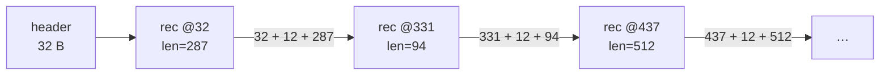
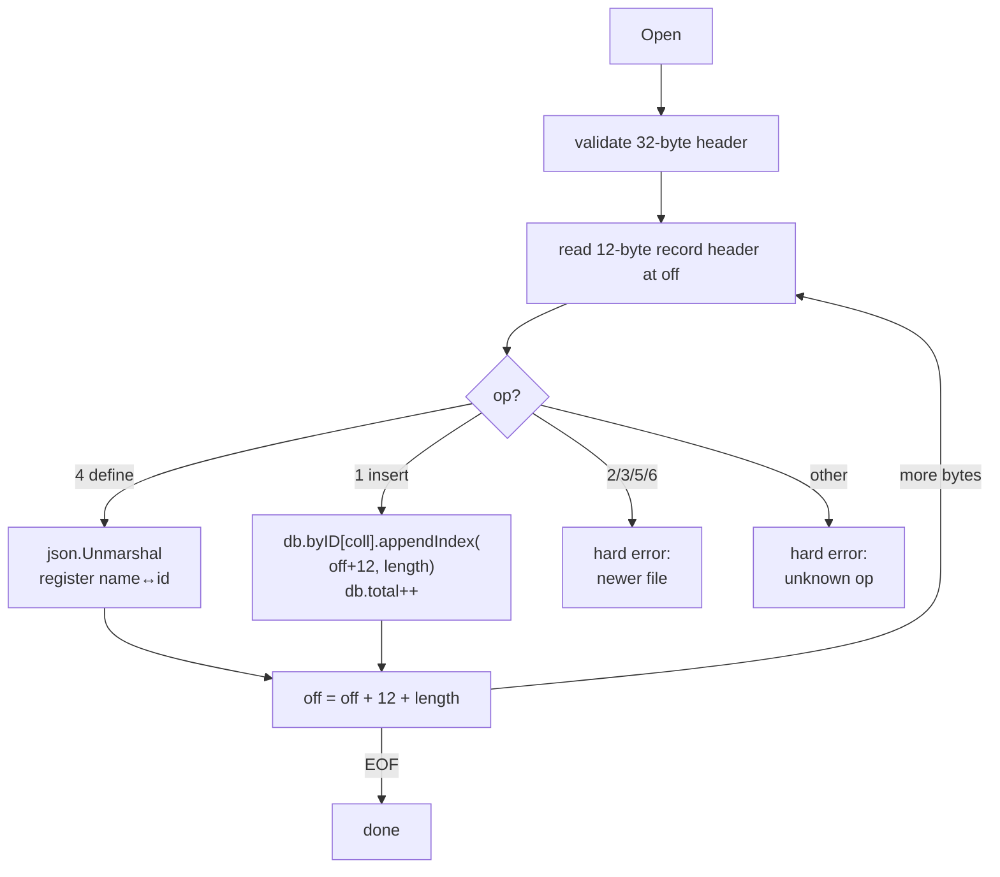
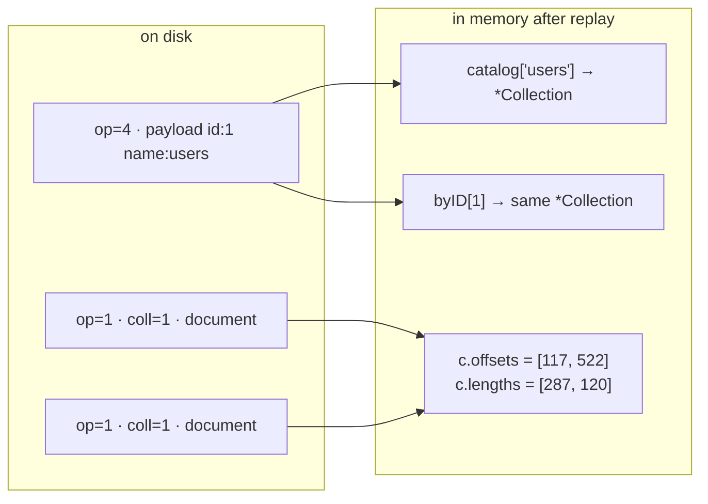
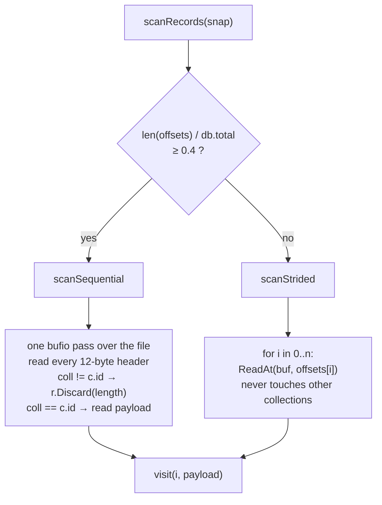

# The file format

What is actually on disk, and how a collection finds its own documents among everybody
else's — [`store.go`](../store.go), [`catalog.go`](../catalog.go),
[`index.go`](../index.go), [`scan.go`](../scan.go).

The one-line version: **the file has no structure beyond "a header, then records
back-to-back". Every question about ordering, membership or traversal is answered by
reading it start to finish once, at `Open`.**

---

## 1. The whole file

```
byte 0                    32
  +-------------------+   +--------+--------+--------+--------+ ... EOF
  |   file header     |   | record | record | record | record |
  |     32 bytes      |   +--------+--------+--------+--------+
  +-------------------+
```

That is the entire layout. There is no index block, no free list, no page directory, no
footer. Records are appended in write order and never moved, never rewritten, never
padded.

Everything below is a consequence of that one decision.

### File header — 32 bytes, written once

| offset | size | field | notes |
|---|---|---|---|
| 0 | 8 | magic `"NSQLITE\n"` | opening a JPEG gives *"not a nosqlite file"*, not a parse error |
| 8 | 2 | `format` u16 | bumped only when the layout changes incompatibly |
| 10 | 2 | `flags` u16 | zero in v1, **validated** as zero |
| 12 | 8 | `created` u64 | Unix nanoseconds |
| 20 | 12 | reserved | zero, and validated as zero |

Written by [`writeFileHeader`](../store.go#L116), checked by
[`readFileHeader`](../store.go#L136).

Validating the reserved bytes as zero is the part worth noticing. It means a future
version can claim them without ambiguity: any file where they are non-zero was written by
something newer, and today's binary refuses it instead of guessing.

### Record — 12-byte header, then exactly `length` payload bytes

The numbers along the top are **boundaries**, not byte indices — each marks where a field
starts, so a field spans from its own marker up to the next one:

```
   0            4    5    6            8                       12                 12+length
   +------------+----+----+------------+-----------------------+------------------+
   |   length   | op |flag|    coll    |         crc32         |     payload      |
   |    u32     | u8 | u8 |    u16     |          u32          |  `length` bytes  |
   +------------+----+----+------------+-----------------------+------------------+
    little-endian                        CRC covers bytes 4-7 (op‖flags‖coll)
                                         followed by the payload
```

Spelled out, because half-open and inclusive ranges are easy to confuse and
[`encodeRecord`](../store.go#L170) is written in Go's half-open form:

| field | bytes (inclusive) | Go slice |
|---|---|---|
| `length` u32 | 0-3 | `dst[0:4]` |
| `op` u8 | 4 | `dst[4]` |
| `flags` u8 | 5 | `dst[5]` |
| `coll` u16 | 6-7 | `dst[6:8]` |
| `crc32` u32 | 8-11 | `dst[8:12]` |
| payload | 12 .. 11+`length` | `dst[12:]` |

> **Go note.** `dst[0:4]` is **half-open**: it includes index 0 and excludes index 4, so it
> is bytes 0-3 — four of them, which is why `len(s[a:b]) == b-a` always. Every range in the
> Go column above is half-open; every range in the inclusive column is not. Mixing the two
> notations in one diagram is exactly how off-by-one bugs get written into a file format.

That is 7 lines of Go, and it is worth reading as the authoritative statement of the
format — this document is a description of it, not the other way round.

| field | why it exists |
|---|---|
| `length` | **the traversal primitive.** See §2. |
| `op` | 1 insert, 4 define-collection. 2/3/5/6 reserved (delete, replace, begin, commit) |
| `flags` | zero in v1, validated. First claim will probably be a compression bit |
| `coll` | which collection owns this record. **This is what makes one file work.** See §4 |
| `crc32` | distinguishes *corrupt* from *torn* — the whole recovery story rests on it |

Note what the CRC covers: `op‖flags‖coll‖payload`. **Not `length`.** That gap is
documented honestly at [store.go:342-353](../store.go#L342-L353) — bit rot in a length
field mid-file is indistinguishable from a torn tail, and gets treated as one. Closing it
means a format bump.

---

## 2. There is no `next` pointer — `length` is the link

A natural question coming from a linked-list mental model: how does one record point at
the following one?

It doesn't. It doesn't need to:

```go
recEnd := off + recordHeaderSize + int64(length)   // store.go:339
...
off = recEnd                                       // store.go:415
```

The record is **self-delimiting**. Knowing where it starts and how long its payload is
tells you where the next one starts, exactly.



Why this beats an explicit pointer, in order of how much it matters:

1. **A bad `length` is detectable; a bad pointer is not.** `length` is bounds-checked
   against the file size before it is trusted ([store.go:342](../store.go#L342)) and the
   payload is then CRC-verified. A corrupt `next` pointer would land you at an arbitrary
   offset that might well *look* like a plausible record header — and you would have no
   way to tell.
2. **Append-only removes the reason for a linked list.** Pointers buy cheap
   splice/unlink in the middle of a structure. Nothing here is ever modified in place, so
   there is nothing to splice.
3. **8 bytes per record for zero information.** At a million records that is 8 MB of file
   restating what is already there.

**What it costs:** framing is strictly *forward-only*. You cannot walk backwards, and you
cannot jump to "record N" without having walked to it. Both are fine, because nothing
ever needs to — random access goes through the in-memory index instead (§3), and that
index is built by exactly one forward walk.

> **Go note.** This is why the reader is `io.ReadFull(r, hdr[:])` into a fixed
> `[12]byte` array rather than a decoder object. The header is fixed-size, so it goes on
> the stack; only the variable-length payload needs a heap buffer, and that one buffer is
> reused for every record.

---

## 3. Replay: the file's structure becomes memory, once

[`replay`](../store.go#L307), called by `Open`, is the only full read of the file in
normal operation.



Three properties make this cheap enough to do on every open:

- **Nothing is unmarshalled.** For an insert, replay records *where the payload is and
  how long it is* and moves on. The only JSON parsed is the handful of
  define-collection records. No allocation per document.
- **One pass builds every collection's index.** Not one pass per collection — the `coll`
  tag routes each record as it goes by.
- **The offset stored is the payload's, not the record header's** —
  `c.appendIndex(off+recordHeaderSize, length)`
  ([store.go:406](../store.go#L406)). So a later read is one `ReadAt` of exactly the JSON
  bytes, with no header to re-parse.

`WithFastOpen()` skips the CRC pass and `Discard`s payloads instead of reading them,
checking only the final record so torn-tail recovery still works. Faster, and weaker: mid-file
bit rot then goes unnoticed until something reads that record.

### Torn tail

Because appends are the only writes, damage can only ever be at the end. That makes
recovery a two-case rule, not a repair algorithm:

| condition | at EOF | mid-file |
|---|---|---|
| short header / short payload | truncate, open succeeds | can't happen |
| `length` exceeds remaining file | truncate, open succeeds | (indistinguishable — see §1) |
| CRC mismatch | truncate, open succeeds | `ErrCorrupt`, refuse to open |

[`truncateTail`](../store.go#L425) cuts back to the end of the last good record and
returns `nil` — a torn tail after a crash is *expected*, not an error. The in-flight
insert is lost, which is correct: it never returned success to the caller.

---

## 4. Interleaving: one file, many collections

This is the part the layout diagram hides. Records from every collection share one
append point, so a real file looks like this:

```
off:     32      68      105     404     510     642
       +-------+-------+-------+-------+-------+-------+
       | def   | def   | ins   | ins   | ins   | ins   |
       | id=1  | id=2  | c=1   | c=2   | c=1   | c=1   |
       | users | orders| Ada   | ord-1 | Grace | Alan  |
       | len24 | len25 | len287| len94 | len120| len…  |
       +-------+-------+-------+-------+-------+-------+
         users ──┐               ┌───────────────┘
                 └───────────────┴─── one collection, three non-adjacent records
```

There is **exactly one append point in the whole database**, guarded by one write lock.
Writes to `users` and `orders` serialise against each other. For an embedded store that
is close to irrelevant — the `fsync` dominates by orders of magnitude — but it is a real
cost, and it is the price of the file being one artifact you can copy, diff, or attach to
a bug report.

### The catalog record

The name `"users"` appears **once** in the file, in an `op=4` record whose payload is
`{"id":1,"name":"users"}`. Every subsequent record carries the 2-byte id instead
([`catalog.go`](../catalog.go)).



Four things fall out of spending a record on this:

- collection ids stay stable across restarts,
- a collection with **zero documents** still exists after reopening,
- `Collections()` is answered from memory with no I/O,
- the name is not repeated a million times.

Ids are assigned sequentially from 1 ([`registerCollection`](../catalog.go#L100)); id 0 is
never valid, which is what makes the wrap check at
[catalog.go:54](../catalog.go#L54) work as the "all 65535 ids taken" tell.

---

## 5. How a collection iterates its documents

Not by following anything on disk. The iterator is two slices in memory:

```go
type Collection struct {
    offsets []int64   // byte offset of each payload   — index.go:41
    lengths []uint32  // payload length
}
```

12 bytes per document, in insertion order, pointer-free so the GC never walks them. A
collection *is* a name, an id, and a sorted list of places to look.

A scan starts by taking a [`snapshot`](../index.go#L96) — under the read lock, for the few
nanoseconds it takes to copy two slice headers, the file size, and `db.total`. Then the
lock is released and the entire scan runs with no lock held, because the bytes it refers
to can never change.

[`scanRecords`](../scan.go#L51) then picks between two read shapes:



| | [`scanSequential`](../scan.go#L70) | [`scanStrided`](../scan.go#L127) |
|---|---|---|
| chosen when | collection holds ≥ 40% of the file's inserts | collection is a small tenant of a big file |
| uses the index? | **no** — re-reads headers and filters on `coll` | yes — one `ReadAt` per entry |
| bytes read | the whole file | only this collection's payloads |
| syscalls | few, large, sequential | one per document, ascending offsets |
| interleaving handled by | `if coll != c.id { r.Discard(length) }` — [scan.go:92](../scan.go#L92) | never encountering it |

The threshold is [`sequentialScanRatio = 0.4`](../scan.go#L43). Both paths return **the
same documents in the same order** — the choice is purely about how many bytes get moved.
That is what makes it a safe optimisation rather than two code paths to keep in sync.

The interesting inversion: the *sequential* path ignores the in-memory index entirely and
re-derives membership from the `coll` byte, because when you own most of the file,
streaming past a few foreign records is cheaper than seeking around your own. The
*strided* path is the one that actually uses `offsets`.

> **Go note — why `ReadAt`, not `Read`.** `ReadAt` is `pread(2)`: it takes an explicit
> offset and never touches the file's shared seek position. So readers and the appending
> writer share **one** `*os.File` with no coordination, no second handle, and no reader
> lock. `WriteAt` on the append path ([store.go:203](../store.go#L203)) is the other half
> of the same bargain.

### What interleaving costs

A sequential read becomes a forward-only *strided* one. At ~300-byte documents against
4 KB pages, a couple of interleaved collections still mostly land on pages the OS
readahead already fetched. Heavy interleaving is what `Compact()` is for — regrouping
records per collection — and that is a roadmap item, not v1.

---

## 6. Correlating the three views

The same record is visible from three places, all keyed by byte offset. This is the
debugging loop:

```
trace file    INSERT  users  _id=018f… off=309200144 len=287   dur=41µs  ok
                                        │
nsq dump      309200144  op=insert  coll=1 users  len=287  {"_id":"018f…",…}
                                        │
memory        c.offsets[i] == 309200156      ← +12, points past the record header
              c.lengths[i] == 287
```

The `off=` in a trace line is the record header; `c.offsets[i]` is the payload, 12 bytes
later. Same record, and `nsq dump --from <off>` takes you straight there.

[`WalkFile`](../store.go#L471) is the inspection-side reader: read-only, never truncates,
never builds an index, and **keeps going past a CRC failure** (reporting it as
`RawRecord.CRCOK`) so `nsq verify` finds every bad record rather than only the first.
That last difference from `replay` is the whole reason it exists as a separate function.

---

## 7. What the format leaves room for

Every roadmap item is an append to the format, not a change to it:

| want | mechanism | format change? |
|---|---|---|
| delete | `op=2` tombstone, payload is the `_id` | no — value reserved |
| update | `op=3` replace record | no — value reserved |
| multi-doc atomicity | `op=5`/`op=6` begin/commit pair | no — values reserved |
| compression | claim a bit in the record `flags` byte | no — validated as zero today |
| per-file feature bits | claim bits in the file-header `flags` | no — validated as zero today |
| > 65535 collections | widen `coll` | **yes** — `formatVersion` bump |
| CRC covering `length` | change the CRC input | **yes** — `formatVersion` bump |

The rule that makes reserving worthwhile: **an unknown or reserved `op` is a hard error
on read, never a skip** ([store.go:408-412](../store.go#L408-L412)). An old binary meeting
a file with delete records fails loudly instead of silently returning deleted documents.
Skipping unknown records would be the friendlier-looking choice and the wrong one.

Reserving the *op value* is the easy half, though. What `op=2`/`op=3` actually cost —
garbage, the index immutability rule, and the two scan paths — is worked out in
[`updates-and-compaction.md`](updates-and-compaction.md).

---

## See also

- [`design.md`](design.md) §3–§4 — the reasoning behind the storage engine and memory model
- [`updates-and-compaction.md`](updates-and-compaction.md) — what changes when records can
  be superseded, and why compaction is about more than space
- [`matcher.md`](matcher.md) — what happens to a payload once the scan has read it
- [`compression.md`](compression.md) — the first real claim on the record `flags` byte
