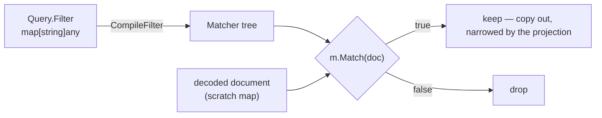

# Filters and projections

The query dialect: which documents come back, and which fields of them. It is
Mongo's, so one filter works from Go, Python, TypeScript and the CLI unchanged.

Code: [`internal/engine/compile.go`](../internal/engine/compile.go),
[`match.go`](../internal/engine/match.go),
[`compare.go`](../internal/engine/compare.go),
[`projection.go`](../internal/engine/projection.go).

---

## Filter — the shapes

| write | means |
|---|---|
| `{}` or omitted | everything |
| `{"name": "Ada"}` | a bare literal is `$eq` |
| `{"age": {"$gte": 30}}` | one operator |
| `{"age": {"$gte": 30, "$lt": 60}}` | two operators on one field are ANDed: `30 ≤ age < 60` |
| `{"name": "Ada", "age": 36}` | two fields are ANDed |
| `{"address.city": "Oslo"}` | dotted path into a nested object |
| `{"tags": "math"}` | an array matches if **any element** matches |
| `{"items.qty": 5}` | reaches into every element of an array of objects |
| `{"$or": [{…}, {…}]}` | either branch |
| `{"$and": [{…}, {…}]}` | both branches |
| `{"age": {"$not": {"$gt": 1}}}` | negate one field's operators |

## Filter — the operators

| operator | matches when |
|---|---|
| `$eq` | equal — deep for arrays and objects |
| `$ne` | not equal — but see the rule below, it negates the whole set |
| `$gt` `$gte` `$lt` `$lte` | ordered comparison, **within one type only** |
| `$in` | the field's value is one of the values in the list |
| `$nin` | it is none of them |
| `$exists: true` | the field is present, even if its value is `null` |
| `$exists: false` | the field is absent |
| `$and` `$or` `$not` | logical, over sub-filters |

Not supported, and rejected rather than ignored: `$elemMatch`, `$all`, `$size`,
`$regex`.

## Filter — the rules

- **Comparison is within-type.** `{"age": {"$gte": 30}}` does not match
  `{"age": "36"}`. Coercion rules invented here would surprise someone; sorting
  uses a cross-type order instead (below).
- **An unknown `$operator` is an error**, before the scan starts. A typo'd
  `$gtee` returning zero rows is the worst possible outcome.
- **Mixing operators and plain keys in one object is an error** —
  `{"a": {"$gt": 1, "b": 2}}` has no coherent meaning.
- **`$ne` and `$nin` negate the whole set**, not "some value differs". So
  `{"tags": {"$ne": "go"}}` rejects a document whose tags contain `"go"` at all.
- **Absent is not `null`.** `{}` and `{"a": null}` are different documents, and
  `$exists` tells them apart.
- **`$or` is the only way to OR two constraints on one field.** Every key inside
  a field's operator document ANDs, so `{"$or": [{"age": {"$lt": 20}}, {"age":
  {"$gt": 60}}]}` has no single-object equivalent.

## Sorting

Sort keys are applied in order, and a missing field is not an error — every
value has a place in one total order:

```
absent < null < numbers < strings < booleans < arrays < objects
```

One `compare` function serves filtering and sorting, so the two can never
disagree. Documents missing the sort field group together at the start. Ties
break by insertion order, so `Sort`+`Limit` returns the same documents in the
same order on every run.

`Sort` without `Limit` is the one query shape that can exhaust memory: every
match must be materialised before it can be ordered. With a limit, the engine
keeps a bounded heap of `Skip+Limit` documents and nothing more.

---

## Projection — the values

**A projection is a document: every key is a field path, every value is `1` or `0`.**

| value | means |
|---|---|
| `1` — or `true` | **include** this field |
| `0` — or `false` | **exclude** this field |
| anything else | an error, including `{"$slice": 2}` and other operators |

## Projection — the shapes

| write | get |
|---|---|
| `{"name": 1, "age": 1}` | only these fields, plus `_id` |
| `{"email": 0, "tags": 0}` | everything except these |
| `{"name": 1, "_id": 0}` | `_id` is the one field exempt from the no-mixing rule |
| `{"address.city": 1}` | the subdocument rebuilt: `{"address": {"city": …}}` |
| `{"items.qty": 1}` | an array of subdocuments projected element-wise |

## Projection — the rules

- **Inclusion and exclusion cannot be mixed.** "Keep name" and "drop email"
  together leaves every other field's fate unstated. `_id` is the exception, as
  in MongoDB.
- **Prefer inclusion.** If you can name the fields you want, name them.
- **Use exclusion only for "the whole document, minus this"** — dropping a
  credential or a large blob, `{"password_hash": 0}`, `{"embedding": 0}`. The
  inclusion form would mean listing every other field and re-editing that list
  forever.
- **An inclusion list is closed; documents are open.** `{"name": 1}` returns
  that field and nothing else, ever. Add a field to your documents next month
  and every query written before it existed silently stops returning it.
- **The projection applies on the way out**, after the filter and the sort — so
  a query may filter or sort on a field it does not return.
- **A numeric segment is a field name here, not an array index.** `"items.0"`
  looks for a key called `"0"`. A rebuilt subdocument has no way to say "element
  3 of an array whose other elements are gone", so there is nothing for an index
  to mean. In a *filter*, the same segment does index an array.
- **`$slice` and the positional `$` are not supported**, and are rejected rather
  than quietly ignored.

---

## How it works

A filter is compiled **once per query, before any I/O**, into a tree of
matchers. The scan loop then does no parsing at all — it is
`if !m.Match(scratch)`.



```go
type Matcher interface {
    Match(doc map[string]any) bool
}
```

| node | matches when |
|---|---|
| `matchAll` | always — what an empty filter compiles to |
| `andNode` | every child matches, short-circuiting on the first false |
| `orNode` | any child matches, short-circuiting on the first true |
| `notNode` | the child does not match |
| `cmpNode` | the value at `path` compares as `op` says |
| `inNode` | `path` reaches one of `values` — inverted for `$nin` |
| `existsNode` | `path` resolves to a value, and that matches what was asked for |

Only the three leaf nodes — `cmpNode`, `inNode`, `existsNode` — touch a
document's fields; the rest just combine their answers. Paths are split at compile
time (`"address.city"` → `["address","city"]`), so no string splitting ever
happens per document. Keys are compiled in sorted order, which keeps the tree
and any error message deterministic — Go randomises map iteration.

### Worked example

```go
map[string]any{
    "age":  map[string]any{"$gte": 30},
    "tags": map[string]any{"$in": []any{"go", "db"}},
    "$or": []any{
        map[string]any{"address.city": "Oslo"},
        map[string]any{"address.city": "Bergen"},
    },
}
```

```
andNode
├── orNode                                             ← "$or" ($ sorts first)
│   ├── cmpNode{["address","city"], opEq, "Oslo"}
│   └── cmpNode{["address","city"], opEq, "Bergen"}
├── cmpNode{["age"],  opGte, 30}
└── inNode  {["tags"], ["go","db"]}
```

A document with `age: 20` fails the `age` leaf and never reaches `tags`.
Child order is sorted-key order, unrelated to selectivity — a planner could
reorder to test the cheapest child first.

### Path walking

`lookupPath` returns **every** value a dotted path reaches, because of Mongo's
implicit array traversal:

```
doc:  {"items": [{"qty": 1}, {"qty": 5}]}
path: ["items", "qty"]     →  [1, 5]      matches if ANY of them matches
```

A path that reaches nothing returns one `absent` sentinel rather than an empty
list, so no caller has to special-case a length of zero. `absent` is an
unexported zero-byte type that code outside the package cannot construct, which
is what keeps it from ever being confused with a real value — including `null`.

`LookupOne` is the sorting counterpart: same walk, first value wins.

Projections share the dotted-path *grammar* and nothing else. Matching asks "does
any value down this path match"; projecting has to rebuild the document's shape
around what it keeps, one subdocument per segment.

### Why a tree, not a closure

The tree is **inspectable**, and that is the extension point for secondary
indexes: a planner walks it for a `cmpNode` on an indexed field, replaces that
subtree with an index lookup, and runs the rest as a residual filter. Nothing in
`match.go` changes. With a closure there would be nothing to walk.

`CompileFilter`, `CompileProjection`, `Matcher` and `Projection` are re-exported
from [`query.go`](../query.go), so a caller can validate a filter without
importing the internal package.

---

## See also

- [`api.md`](api.md) — where a filter goes in each language
- [`design.md`](design.md) — how the scan executes and what it costs
- [`nosql-primer.md`](nosql-primer.md) — the dialect itself, if it is new
