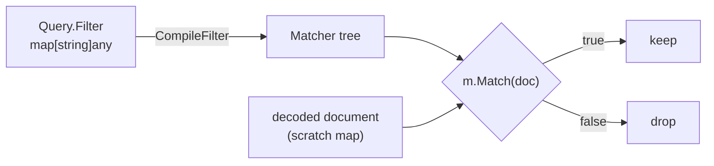
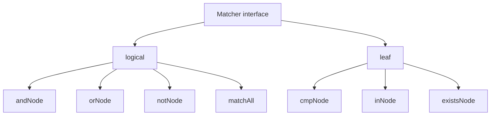

# The matcher

How a Mongo-dialect filter document becomes a thing that answers *"does this document
match?"* — [`internal/engine/compile.go`](../internal/engine/compile.go),
[`match.go`](../internal/engine/match.go), [`compare.go`](../internal/engine/compare.go).

---

## 1. Two halves, two moments

| | when | file | output |
|---|---|---|---|
| **Compile** | once per query, before any I/O | `compile.go` | a `Matcher` tree |
| **Match** | once per document scanned | `match.go` | `bool` |



Everything expensive happens in the compile step: paths are split, operators are
resolved, arguments are normalised. The scan loop then does no parsing at all —
[`scan.go:198`](../scan.go#L198) is just `if !m.Match(scratch)`.

A bad filter fails **before** the scan starts, not halfway through it. `$gt3` is a
compile error, never a silent zero-row result.

---

## 2. `Matcher` is one method

```go
type Matcher interface {
    Match(doc map[string]any) bool
}
```

Go notes, since this is where Go differs from C#/TypeScript:

- **No `implements`.** `andNode` is a `Matcher` because it has a `Match` method. The
  compiler checks structurally, at the assignment site.
- **Value receivers.** `func (n andNode) Match(...)` — the nodes are copied into the
  interface, not referenced. They are immutable after compile, so there is no shared
  state to race on.
- **The tree is data, not closures.** A closure would be smaller but opaque. A tree can
  be *walked* — which is the whole point (§7).

---

## 3. The node types



| node | fields | matches when |
|---|---|---|
| `matchAll` | — | always — what an empty filter compiles to |
| `andNode` | `children` | every child matches, short-circuiting on the first false |
| `orNode` | `children` | any child matches, short-circuiting on the first true |
| `notNode` | `child` | the child does not match |
| `cmpNode` | `path`, `op`, `value` | the value at `path` compares as `op` says |
| `inNode` | `path`, `values`, `negate` | `path` reaches one of `values` — inverted for `$nin` |
| `existsNode` | `path`, `want` | `path` resolves to anything at all, `== want` |

Only the three leaf types ever touch a document's fields. Everything else just combines
their answers.

---

## 4. Compilation rules

`compileDocument` walks the filter object key by key, **in sorted order** — Go randomises
map iteration, and sorted keys make the tree and any error message deterministic.

| filter shape | compiles to |
|---|---|
| `{}` or `nil` | `matchAll{}` |
| two or more keys in one object | `andNode` over them (implicit AND) |
| `{"name": "Ada"}` | `cmpNode{path, opEq, "Ada"}` — a bare literal is `$eq` |
| `{"age": {"$gte": 30, "$lt": 40}}` | `andNode` of two `cmpNode`s |
| `{"$or": [ … ]}` | `orNode` over each branch |
| `{"$and": [ … ]}` | `andNode` over each branch — same code path as `$or` (`compileBranches`), just building the other logical node |
| `{"a": {"$not": {"$gt": 1}}}` | `notNode` wrapping the compiled field |
| `{"a": {"$gt": 1, "b": 2}}` | **error** — mixes operators and plain keys |
| `{"a": {"$nope": 1}}` | **error** — unknown operator |

### Implicit AND vs. explicit `$and`

Two or more operators inside *one field's* operator document are always ANDed — there is
no way to get an OR out of that shape, because it compiles to a single `andNode` before
`$or`/`$and` ever come into play. That's why a range needs no operator at all:

```
{"age": {"$gte": 20, "$lte": 30}}
```

is already `20 ≤ age ≤ 30`. Writing it with an explicit `$and` is equivalent — legal, just
more verbose:

```
{"$and": [{"age": {"$gt": 20}}, {"age": {"$lt": 60}}]}
```

`$and` only earns its keep when the constraints can't be merged into one operator document —
most commonly ORing two constraints on the *same* field, which implicit AND cannot express at
all: `{"$or": [{"age": {"$lt": 20}}, {"age": {"$gt": 60}}]}` reads "younger than 20 or older
than 60"; there is no `{"age": {...}}` shape that means the same thing, since every key inside
one field's operator document ANDs together.

### Worked example

```go
map[string]any{
    "age":  map[string]any{"$gte": 30},
    "tags": map[string]any{"$in": []any{"go", "db"}},
    "$or": []any{
        map[string]any{"address.city": "Oslo"},
        map[string]any{"address.city": "Bergen"},
    },
}
```

Sorted keys are `$or, age, tags` (`$` sorts before letters), so:

```
andNode
├── orNode                                             ← "$or"
│   ├── cmpNode{["address","city"], opEq, "Oslo"}
│   └── cmpNode{["address","city"], opEq, "Bergen"}
├── cmpNode{["age"],  opGte, 30}                       ← "age"
└── inNode  {["tags"], ["go","db"]}                    ← "tags"
```

Note the paths in the tree are already slices: `SplitPath` ran once at compile time, turning
`"address.city"` into `["address","city"]`. No string splitting ever happens per document.

Children are evaluated left to right and stop at the first decisive answer: `andNode` returns
`false` on the first child that fails, `orNode` returns `true` on the first that succeeds. A
document with `age: 20` fails the `age` leaf and never reaches `tags`.

Child order is sorted key order (or array order for explicit `$and`/`$or`) — unrelated to cost
or selectivity. A planner could reorder them to test the cheapest, most selective child first.

---

## 5. Path walking

`lookupPath` resolves a dotted path and returns **every** value it reaches — a slice, not
a single value, because of Mongo's implicit array traversal.

```
doc: {"items": [{"qty": 1}, {"qty": 5}]}
path: ["items", "qty"]

collectPath(doc, [items qty])
  └ map     → key "items" exists
    collectPath([{qty:1},{qty:5}], [qty])
      └ array → "qty" is not a number, so index into it is skipped
        apply "qty" to each element:
          collectPath(1, []) → out += 1
          collectPath(5, []) → out += 5

→ [1, 5]      matches if ANY of them matches
```

Three details worth knowing:

- **Fast path.** A single-segment path (`["age"]`) is answered with one map lookup and
  one small slice — no recursion.
- **Numeric segments index arrays**: `"items.0.qty"`. The same segment is *also* applied
  to each element, so an array of objects with a `"0"` key would contribute twice.
  Harmless: the semantics are already "any value matches".
- **Nothing found ≠ empty slice.** `lookupPath` returns exactly one `absent` sentinel, so
  callers never special-case length zero. `existsNode` detects it precisely:

  ```go
  exists := !(len(found) == 1 && isAbsent(found[0]))
  ```

`LookupOne` is the sorting counterpart — same walk, first value wins.

**Projections walk paths, but not with this.** `Query.Projection` (`projection.go`) shares the
dotted-path *grammar* and nothing else: matching asks "does any value down this path
match", so it collects every value a path reaches, whereas projecting has to rebuild the
document's shape around the values it keeps — one subdocument per segment, one narrowed
element per array entry. Two consequences follow, and both are Mongo's behaviour as well:
a projected `"items.qty"` yields `{"items": [{"qty": …}, …]}` rather than a flat list of
qtys, and a numeric segment is *not* an array index there, because a rebuilt subdocument
has no way to say "element 3 of an array whose other elements are gone".

---

## 6. Value semantics

### The absent sentinel

`absent` is an `any` holding an unexported `absentValue struct{}`. Zero bytes, and code
outside the package cannot construct one, so it can never be confused with real data.
It is distinct from JSON `null` — `{"a": null}` and `{}` are different documents.

### Total order (`compare.go`)

```
absent < null < numbers < strings < booleans < arrays < objects < unknown
```

One `compare` function serves both filtering and sorting, so they can never disagree.
Arrays compare element-wise then by length; objects compare by sorted key, which makes
`equalValues` deep equality.

### Ordering comparisons are within-type only

```go
if typeRank(v) != typeRank(n.value) { return false }
```

`{"age": {"$gte": 30}}` does **not** match `{"age": "36"}`. Sorting uses the cross-type
order; `$gt`/`$lt` deliberately do not. Inventing coercion rules would surprise someone.

### Arrays match by whole *or* by element

`cmpNode.Match` tries the value as-is first, then each element if it is an array:

| document | filter | result |
|---|---|---|
| `{"tags": ["math"]}` | `{"tags": ["math"]}` | ✅ whole-array equality |
| `{"tags": ["math","cs"]}` | `{"tags": "cs"}` | ✅ element match |

### `$ne` and `$nin` negate the whole set

`$ne` is *not* "some value differs" — it is `!$eq`, evaluated over every candidate the
path reaches:

```go
if n.op == opNe {
    eq := cmpNode{path: n.path, op: opEq, value: n.value}
    return !eq.Match(doc)
}
```

So `{"tags": {"$ne": "go"}}` rejects a document whose tags contain `"go"` at all.
`inNode.negate` works the same way — collect a hit, then invert.

---

## 7. Why a tree

The tree is inspectable, and that is the extension point for secondary indexes: a planner
walks it looking for a `cmpNode` on an indexed field, replaces that subtree with an index
lookup, and runs the remainder as a residual filter. Nothing in `match.go` changes.

`CompileFilter` and `Matcher` are re-exported from
[`query.go`](../query.go#L69-L77) as aliases (`type Matcher = engine.Matcher`), so callers
can validate a filter without ever importing the internal package.
