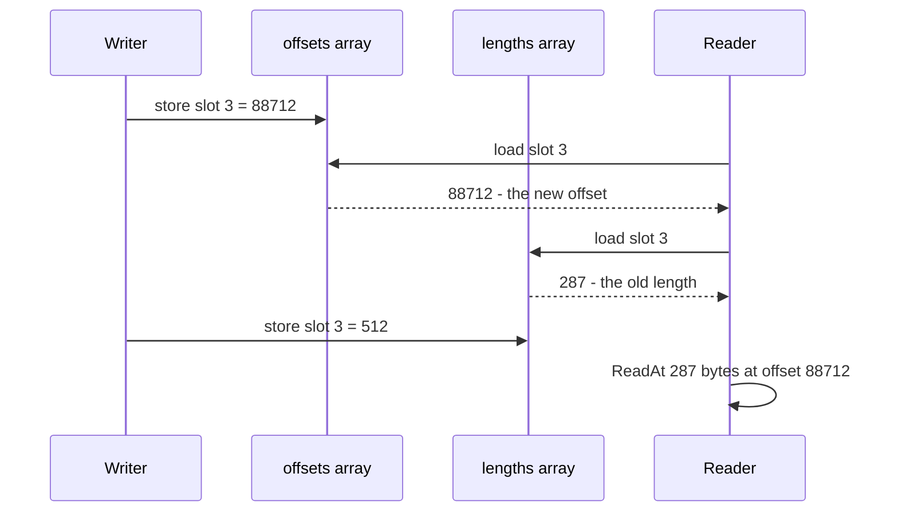
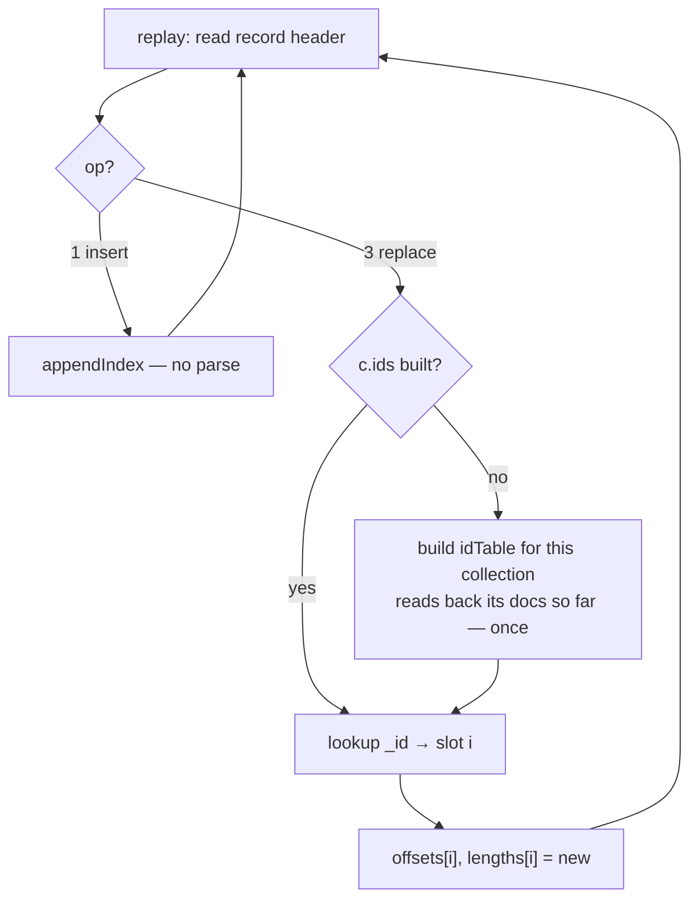
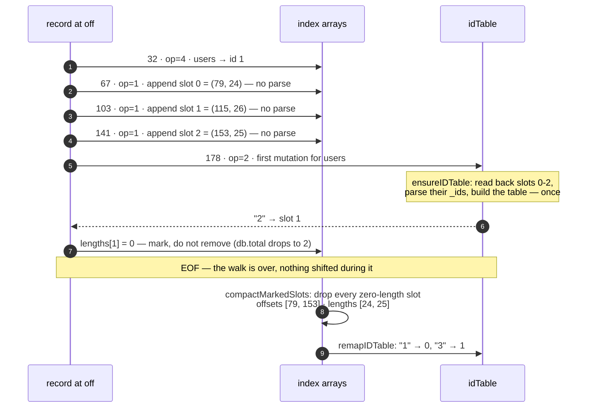

# Replace, delete, garbage, and compaction

How mutation works on an append-only file: what `Replace` and `Delete` do to the file, to
the in-memory index, and to the cost of opening a database.

Companion to [`file-format.md`](file-format.md), which describes the record format itself.
This is roadmap item 1 of [`design.md`](design.md) §11. `Replace` and `Delete` are built,
replay included; `Compact` is designed here but not yet written — §8 tracks which is
which.

## Terms

There are two orderings of the same documents here, and most of this design's subtleties
live in the gap between them. Where the two could be confused, the text below says which
one it means.

| term | is | lives |
|---|---|---|
| **the index**, **the index arrays** | `c.offsets []int64` and `c.lengths []uint32` in [`index.go`](../index.go) — one element per live document, in insertion order | memory |
| **position**, or the subscript `i` | where a document sits in those arrays | memory |
| **slot** | the same thing, used where the emphasis is on the element rather than the ordering | memory |
| **offset** | where a document's bytes start in the file | disk |

**There is no index on disk.** The database file is framed records in write order and
nothing else — no allocation bitmap, no free list, no per-record live flag, no tree.
Everything the engine knows about *where* a document is, and whether it is still live, is
derived state held in memory and rebuilt by `replay` on every `Open`. (Secondary indexes,
roadmap item 2, do not change this: design.md §11 has them rebuilding from the log too.)

Most of §2 follows from one sentence in that vocabulary: **a replace keeps a document's
position and changes its offset.**

---

## 1. Payload size does not matter

Update a document with a larger payload, a smaller one, or an identical one: it makes no
difference. That is the single biggest thing the append-only layout buys, and it is easy
to miss when carrying a slotted-page intuition into it.

| | slotted-page store (SQLite, Postgres) | append-only log (here) |
|---|---|---|
| update fits in place | rewrite the slot | append |
| update is **larger** | doesn't fit → overflow page, or migrate the row and leave a forwarding pointer | append |
| update is **smaller** | slot keeps its size, internal fragmentation | append |
| code paths | three, plus a free-space map | **one** |

An update is `db.appendRecord(opReplace, c.id, newPayload)` at `db.size`, exactly like an
insert ([`appendRecord`](../store.go)). There is no size class, no free list, no
best-fit search, no page split. That whole family of problems is traded away.

What gets traded *for* it is the subject of the rest of this document.

### Nothing is "marked as unused"

There is nowhere to mark it. The file has no allocation bitmap, no free list, and no
per-record live flag — and a live flag is not an option, because setting one means
**writing in place**, which would break the CRC of an already-written record, break
torn-tail recovery (damage would no longer be only at the tail), and break lock-free
readers all at once.

Instead:

> **A record is dead if, and only if, nothing in the in-memory index points at it.**

The in-memory index is the sole authority on liveness, and it is rebuilt from scratch on
every `Open` ([`replay`](../store.go)). The file itself is just bytes in write order.

```
       live                    dead                   live
        │                       │                      │
   +---------+  +---------+  +---------+  +---------+  +---------+
   | ins v1  |  | ins v1  |  | ins v1  |  | rep v2  |  | rep v2  |
   | doc A   |  | doc B   |  | doc C   |  | doc C   |  | doc B   |
   +---------+  +---------+  +---------+  +---------+  +---------+
        ▲            ▲                         ▲            ▲
        │            └────────────┐            │            │
        │                         │  ┌─────────┘            │
   c.offsets = [ A ,              B(new) ,           C(new) ]
                                  └──────────────────────────┘
                       nothing points at the two dead records
```

So yes: the file only ever grows, and garbage accumulates. Update every document *k*
times and the file is (k+1)× the live size. That is ordinary log-structured economics,
it is well understood, and **it is not the hard part.**

---

## 2. Three invariants mutation breaks

The difficulty is not space. It is that three separate fast paths in this codebase assume
*a slot's contents never change*.

Everything below is written in terms of replace, because that is where each break is
easiest to see. **Delete breaks all three the same way** — removing a slot mutates the
arrays just as re-pointing one does — so §6 inherits this section rather than repeating
it.

### 2.1 The in-memory index immutability rule

[`appendIndex`](../index.go) states it outright:

> **Once an index entry is visible to a snapshot, its value never changes again.**

Appending is exempt, and it is worth seeing why, because `append` can write into the very
array a reader is holding. [`snapshot`](../index.go) caps its slices with
`c.offsets[0:n:n]`, so a reader can only ever look at positions `0..n-1` of the array as
it was when the snapshot was taken. `append`'s write lands at index `n` — outside that
view. Reallocating is equally invisible: the reader simply keeps the old array.

A replace wants the case the rule actually forbids: `offsets[i]` must move from the old
payload to the new one, for an `i` that readers are already looking at. And they scan with
**no lock held**, sharing the writer's backing array.

The escape hatch — the only safe way to change such an entry — is to build new arrays and
publish them under the write lock, which is what §4 does. Being precise about what
"changes" there matters: the document at position `i` gets a new offset, while *element
`i` of every array a reader is currently holding* is never written. The rule governs
elements of published arrays, not positions in the abstract.

This is not a theoretical race. `offsets` and `lengths` are two *separate* arrays
([`Collection`](../index.go)), so there is no way to update both as one
operation:

Slot 3 starts as `offset 990, length 287` and is being updated to `offset 88712,
length 512`. The writer sets the two arrays one after the other; a reader lands in
between:



The reader now holds a **new offset with an old length** and reads 287 bytes from a
record that is 512 long: truncated JSON, or — if the lengths went the other way — a read
straddling into whatever follows.

Silent corruption, not a crash. And independently of the mismatch, a concurrent
read/write of the same word with no synchronisation is a data race by the Go memory
model — `go test -race` would flag it even on a 64-bit machine where the store happens to
be atomic in practice.

### 2.2 `scanSequential` is only correct while nothing is superseded

[`scan.go`](../scan.go)'s sequential path deliberately **ignores the index** and
re-derives membership from the file:

```go
if coll != c.id || op != opInsert {
    r.Discard(int(length))
    continue
}
```

That is valid only while *"every insert record with this coll id, in file order"* **is**
the collection. One replace or delete makes it false — the pass streams past both the old
and the new version of a document with no way to tell which is live. Resolving it by
`_id` would mean parsing every record and carrying a seen-set, which destroys the
streaming property that justifies the path in the first place.

The engine therefore does not try. `Collection.dirty` ([`index.go`](../index.go)) is set
the first time a document in the collection is superseded, and `scanRecords` sends every
subsequent scan down the strided path, which reads the index and so knows exactly which
records are live. It is a blunt instrument — one replace disables the fast path for the
whole collection — but it is one bool and one branch, it fails in the safe direction, and
`Compact` clears it.

`dirty` is captured into `snapshot` rather than read at scan time, because `scanRecords`
runs with no lock held and reading the live field there would be a data race.

One related imprecision, accepted deliberately: `db.total` counts *documents*, not
records, so it does not grow when a replace does. It is the denominator of the
sequential-versus-strided ratio, which means a file carrying a lot of superseded records
looks cheaper to scan sequentially than it is. That costs a little accuracy for *other*
collections sharing the file; the mutated collection itself is pinned to the strided path
by `dirty` regardless. Counting records instead would fix the ratio and break `traceOpen`,
which reports the same field as `docs=`.

### 2.3 Offsets stop ascending

Easy to miss, and it has teeth. The replacement lands at the end of the file, so:

```
before:   offsets = [ 44,   522,   990,  1408 ]      ascending
update doc 1:
after:    offsets = [ 44, 88712,   990,  1408 ]      not ascending
```

Two things depended on that ordering:

- [`scanStrided`](../scan.go) advertises *"the offsets ascend, so this is a
  forward-only strided read that the page cache handles well."* It becomes genuine random
  I/O.
- It removes the cheap fix for §2.2 — walking the file and an ascending offset list
  together as a merge, O(1) per record, no hash set.

**This reframes what compaction is for.** It is not primarily space reclamation. It is
what *restores the invariants the fast paths depend on*: contiguity, ascending offsets,
file-order equal to insertion-order, and per-collection locality, all in one pass.

---

## 3. The record

`op = 3` is a replace and `op = 2` is a delete ([`store.go`](../store.go)). Both fit the
existing framing, so mutation needed no format change. An op a binary does not understand
is a **hard error** on read rather than a skip, so an older binary meeting a file with
replaces in it fails loudly instead of silently serving stale documents.

**A replace payload is the complete new document, not a diff.**

| | full document | diff / patch |
|---|---|---|
| record size | full doc every time | small |
| reading a document | one `ReadAt` | base record + every diff since — or a materialised cache |
| replay | position-independent | must apply diffs strictly in order |
| implementation | `Insert` plus an index fixup | a new subsystem |

The full document wins on everything except bytes written, and bytes-on-disk is exactly
what compaction exists to reclaim. Diffs would trade a solved problem for an unsolved one.

A delete record is the same shape with an `_id`-only payload and **no new index
entry** — which sounds like a footnote and is not. §6 is entirely about what that
sentence hides.

---

## 4. How the in-memory index changes

The index arrays swap in a whole new pair of slices under the write lock
([`replaceIndex`](../index.go)). Two alternatives were weighed against it; the trade is
**cost per call** against **keeping snapshot semantics**.

| | cost per **call** | snapshot isolation | complexity |
|---|---|---|---|
| **A.** copy both slices, swap under the write lock — *implemented* | O(n) — 12 MB at 1M docs | preserved | ~10 lines |
| **B.** chunked slices `[][]int64` | O(√n) — see below | preserved | ~60 lines |
| **C.** `[]atomic.Pointer[chunk]`, per-chunk atomic store | O(chunk) | **lost** | ~60 lines + memory-model care |

**A is what the engine does.** Two reasons, and the first is the one that matters:

1. **Mutation is filter-based, so it is a bulk operation.** One call, under one write
   lock, with **one** index rebuild at the end. Updating 1,000 documents costs one 12 MB
   copy, not a thousand — the O(n) is per *call*, not per document.
2. A 12 MB memcpy is ≈1 ms at typical memory bandwidth. The default durability mode pays
   an `fsync` per write, which is 0.5–2 ms on an SSD. The copy is *the same order of
   magnitude as a cost the design accepts elsewhere.*

It also preserves the immutability rule verbatim rather than weakening it, which is
exactly the escape hatch design.md §4 reserves:

> Anything that would violate it — in-place compaction, for instance — has to swap in a
> whole new pair of slices under the write lock instead.

The pathological case is a tight loop of single-document calls. If a benchmark ever shows
that is a real workload, **B** is the answer, and the sizing is recorded here so nobody
re-derives it:

> cost(c) = 12c (copy one chunk) + 48n/c (copy two outer slices of 24-byte slice headers).
> Minimised at c = 2√n. For n = 1M: c ≈ 2000, cost ≈ 48 KB per update — a 250× improvement
> over A.

**C is listed to be ruled out.** Storing chunk pointers atomically removes the outer copy
entirely, but a reader can then observe chunk 3 updated and chunk 7 not — some documents
at their new version, some at their old, within one scan. That is no longer the
point-in-time view design.md §6 promises as documented behaviour. Not worth it.

> **Go note — this is RCU, and the GC does the hard half.** Read-Copy-Update in C or C++
> needs epoch-based reclamation or hazard pointers to answer *"when is it safe to free the
> old array?"* — that is most of the difficulty. In Go the answer is free: a reader's
> `snapshot` holds a slice header referencing the old array, so the old array is reachable,
> so it simply is not collected until the last reader drops it. No refcount, no epoch, no
> `free`. The same reason [`snapshot`](../index.go) needs no cleanup.

### The document keeps its position

A replaced document keeps its position `i` in the in-memory index arrays instead of
gaining a new one at the end. What changes is the *value* stored there: the
byte offset moves to the end of the file, since that is where the replacement was
appended. Position in memory fixed, position on disk moved — §2.3 is the same fact seen
from the other side, which is why the offsets stop ascending.

(The write lands in the fresh arrays, so §2.1's rule still holds: the arrays readers are
holding are never touched.)

Two consequences, both wanted:

- **Insertion order is preserved.** A replaced document stays where it was in an unsorted
  query's results, instead of jumping to the end — because a scan iterates index
  positions, not file order. That holds on the strided path, which reads the index; the
  sequential path walks the file, where the replacement genuinely is at the end. Order is
  a second reason `dirty` (§2.2) has to force the strided path, alongside correctness
  about *which* documents come back at all.
- **`Len()` stays exact** as `len(c.offsets)`, and so does `Count(nil)`, which
  short-circuits to it in [`collection.go`](../collection.go). §6.3 keeps that true for
  deletes, by removing the slot outright rather than tombstoning it.

### Finding the slot to replace

The write path has to scan for the document it is about to supersede, and it does so
holding the write lock. It therefore builds its snapshot through `snapshotLocked` rather
than `snapshot`: Go's `RWMutex` is not reentrant, so taking the read lock while already
holding the write lock deadlocks rather than failing loudly.

### The idTable needs no work

`_id` is immutable — `Replace` keeps the matched document's `_id` and rejects a
replacement carrying a different one with `ErrImmutableID` — and the document keeps its
slot. Every fingerprint in the idTable therefore still maps where it did, so the live
write path never touches it. §5's cost falls on replay, not here.

---

## 5. Replay resolves records by `_id`

Replay parses **nothing** for an insert ([`store.go`](../store.go)) — that is why `Open`
is one sequential read plus a CRC pass. To apply a replace or a delete, though, replay
must know *which slot it supersedes*, and the only stable answer is the `_id`.

The idTable that answers that question is lazy ([`ensureIDTable`](../index.go)) and most
workloads never build it. Building it unconditionally would add +24 bytes/doc to the
12 MB headline figure — a 3× increase — for every database, including ones that never
mutate anything.

**The rule:** replay stays parse-free until it meets the **first** `op=2`/`op=3` record
for a given collection. At that moment it builds that collection's idTable by reading back
the documents it has already indexed, then continues with cheap lookups.



- A file that was never mutated pays **nothing** — the parse-free property holds exactly.
- A mutated collection pays one extra read of its own documents, once, at open.
- The charge is per *collection*, not per database, so one mutated collection does not tax
  the others.

Three rules the lazy build drags along with it, each of which is silent corruption rather
than an error if missed:

- **Inserts after the table exists must be added to it.** Once a collection's idTable has
  been built part-way through a replay, every later `op=1` for that collection has to go
  in too, or a replace naming one of those documents cannot resolve. This is the one place
  the parse-free property genuinely erodes: after the first replace, that collection's
  inserts get parsed for their `_id` as well. Still nothing for collections that were
  never mutated.
- **`WithFastOpen` cannot skip a replace payload.** It skips payloads to save the CRC
  pass, but a replace record's payload is the only place its `_id` appears — and by the
  previous rule, so is an insert's once the table is live.
- **Replay must set `dirty`** (§2.2). Miss it and a reopened database takes the sequential
  path and serves the superseded version of every document it was asked to replace.

Applying the record itself writes `offsets[i]`/`lengths[i]` **in place**, which is safe
here and nowhere else: replay runs inside `Open`, before the `DB` is handed to the caller,
so no snapshot exists and §2.1's rule has nobody to protect. Going through the
copy-on-write path would copy both arrays once per replace record — O(n·m) to open a file
holding m of them.

A replace whose `_id` is not in the table means the file disagrees with itself, and
`Open` reports `ErrCorrupt` rather than guessing.

---

## 6. Delete

A delete is an append, like everything else:

```go
db.appendRecord(opDelete, c.id, []byte(`{"_id":"ord-1"}`))
```

That is the whole write side. Nothing is erased, nothing is overwritten, the original
`op=1` record stays byte-for-byte where it was. **You add ~27 bytes to the file in order
to remove a document.**

### End to end: three inserts and one delete

Everything in §6 in one worked example. Three documents go in, the middle one is deleted,
and the database is reopened. The offsets and lengths below are the real ones — this is
`nsq dump` output for the file those calls produce.

**After the three inserts.** One `op=4` record names the collection, then one `op=1` per
document. The index holds the *payload* offset, which is the record offset + 12.

```
file                                            index — users
off:  32      67      103     141               position:    0     1     2
    +-------+-------+-------+-------+           offset:     79   115   153
    | def   | ins   | ins   | ins   |           length:     24    26    25
    | users | _id 1 | _id 2 | _id 3 |           (_id:      "1"   "2"   "3")
    +-------+-------+-------+-------+
```

**`Delete({"_id": "2"})`.** An 11-byte payload naming only the `_id` is appended. Nothing
in the file changes; the `op=1` record for document 2 stays byte-for-byte where it was.

```
file                                                    index — users
off:  32      67      103     141     178               position:    0     1
    +-------+-------+-------+-------+-------+           offset:     79   153
    | def   | ins   | ins   | ins   | del   |           length:     24    25
    | users | _id 1 | _id 2 | _id 3 | _id 2 |           (_id:      "1"   "3")
    +-------+-------+-------+-------+-------+
                      ^                ^
                      |                nothing points at this record — ever
                      still on disk, now unreachable
```

`Len()` is 2 and a query returns documents 1 and 3, because the index slot is gone. The
file grew from 178 to 201 bytes, and `DeadBytes()` is 61 — the abandoned insert (12 + 26)
plus the tombstone (12 + 11), which is garbage the moment it is written (§6.7).

**Reopen.** Replay walks all five records and rebuilds that same index from the file
alone. The delete is applied in two phases, and the second one is where the slot actually
disappears:



So yes — the index ends up holding documents 1 and 3, in that order. Two details the
picture is easy to read past:

- **The tombstone is never read by a query.** Its only reader is replay, and replay wants
  exactly one thing from it: which `_id` died (§6.1).
- **The live `Delete` did not go through mark-then-compact** — it removed the slot
  immediately (§6.3). The two phases exist only because replay resolves `_id`s through a
  table keyed by slot number, and slot numbers must not move mid-walk (§6.4). Both paths
  have to land on the same index, which is what `TestReplaySurvivesDelete` and
  `TestDeleteThenReopenAgreesWithScanLive` in [`delete_test.go`](../delete_test.go) pin
  down.

### 6.1 Why write anything at all

The obvious objection, and the thing worth getting straight first: if `Delete` just drops
the index slot in memory, why touch the file?

Because **memory is derived state, rebuilt from the file on every `Open`**
([`replay`](../store.go)). Drop the slot in memory only, restart, and replay walks
the file, finds the original insert record, and the document comes back:

```
file:     [ ins A ] [ ins B ] [ ins C ]
index:      slot0     slot1     slot2

  Delete B  ->  drop slot1 from the index only

index:      slot0     slot1(C)

  restart   ->  replay reads the file

index:      slot0     slot1     slot2        <- B is back
```

So the tombstone is **a message to future replays, not to queries.** No running query
ever reads an `op=2` record; the scan skips it on the `op != opInsert` test that already
exists at [`scanSequential`](../scan.go). Its entire job is to make replay reproduce the
deletion — it turns *"the index forgot"* into *"the file records that it was forgotten."*

### 6.2 What "no new index entry" means

The contrast with the other two operations is the point:

| | record appended | payload | index afterwards | `Len()` |
|---|---|---|---|---|
| **insert** | `op=1` | full document | **+1 slot**, pointing at the new record | +1 |
| **update** | `op=3` | full document | same count; slot `i` **re-pointed** at the new record | unchanged |
| **delete** | `op=2` | just the `_id` | **−1 slot**; *nothing points at the tombstone* | −1 |

An update's record is a live document, so something must point at it. A delete's record
is not a document at all — it is a marker, unreferenced from the moment it is written.

That is also why the payload is only the `_id`: nobody will ever read this record to
answer a query. Replay needs exactly one thing from it — *which* document died.

### 6.3 The slot, and a trap in the idTable

Two options for the in-memory slot:

| | cost | `Len()` | notes |
|---|---|---|---|
| **remove the slot** — `append(offsets[:i], offsets[i+1:]...)` | O(n) shift | stays `len(offsets)` | free: §4 already copies both arrays per call |
| **tombstone the slot** — `lengths[i] = 0` | O(1) | needs a separate live counter | dead slots hold 12 B of RAM each until compaction |

**The slot is removed**, because §4 copies both arrays per call anyway, so the shift
rides along at zero marginal cost. `Len()` stays exactly
`len(c.offsets)` and `Count(nil)` keeps its O(1) short-circuit at
[`Count`](../collection.go). That answers design.md §12's question about `Len()`.

**But removing slot `i` shifts every later slot down by one**, and the idTable's
`positions` array holds slot numbers ([`idTable.positions`](../index.go)). Every entry
`> i` is now wrong.

And the obvious repair — clearing that id's slot in the table — is a bug. The table is
open-addressed with linear probing, and `forEachCandidate` terminates on a zero
fingerprint ([`forEachCandidate`](../index.go)):

```go
for t.fingerprints[i] != 0 {
```

Zero a slot in the middle of a probe chain and every entry *behind* it becomes
unreachable. Classic linear-probing deletion hazard, and note there is no spare sentinel
value to use instead: [`fingerprint`](../index.go) already folds `0` to `1`, so `1`
is a legitimate fingerprint.

> **Deletes rebuild the idTable from scratch**, alongside the COW rebuild of
> `offsets`/`lengths`. No in-place table deletion, no sentinel, no probe-chain repair, and
> it costs nothing extra because the arrays are being rebuilt anyway.

### 6.4 Replay: mark, then compact once

Applying deletes *during* the replay walk means slot numbers shift mid-walk, while the
idTable being used to resolve `_id`s is indexed by slot number. Fiddly, and easy to get
subtly wrong.

Two phases instead:

```
pass 1 — the existing walk:
    op=1  ->  append slot                        (no parse)
    op=3  ->  resolve _id -> i, re-point slot i
    op=2  ->  resolve _id -> i, set lengths[i] = 0     <- mark, do not remove

once, at the end of replay:
    compact out every zero-length slot
    rebuild the idTable
```

Nothing shifts during the walk, so positions stay valid throughout, and the end-of-replay
cleanup is a single O(n) pass per collection that saw a tombstone. The `_id` resolution
uses the same lazy-build-on-first-`op=2`/`op=3` rule as §5 — a database that never deletes
still replays without parsing a single document.

**The mark is also how the idTable entry is retired.** The obvious move would be to drop
the dead `_id` from the table during the walk, and §6.3 has just ruled that out: there is
no way to remove one entry without breaking the probe chain behind it. So the entry stays,
and `lookupID` ([`lookupID`](../index.go)) skips any candidate whose length is zero rather
than reading it. Two things fall out, and both are load-bearing:

- Without the skip, `idAt` reads a zero-byte payload and `json.Unmarshal` fails with
  *"unexpected end of JSON input"* — so `Open` would reject a perfectly good file. This is
  not a tidiness measure.
- It is exactly what makes §6.5 work. Delete-then-re-insert leaves two entries sharing one
  fingerprint, one pointing at the marked slot; the lookup walks past the marked one and
  finds the live document.

A zero length is unambiguous as a marker because no document can have one — the shortest
payload any record can hold is `{"_id":"x"}` — and published index arrays never contain
one, since the live path removes the slot instead of zeroing it.

**A tombstone naming an `_id` the collection does not hold is `ErrCorrupt`**, the same
answer §5 gives an unresolvable replace. `Delete` resolves its match before writing
anything (§9), so nothing this engine writes can produce one; a file containing one
disagrees with itself.

### 6.5 Delete, then re-insert the same `_id`

Worth tracing, because it shows where the meaning actually lives:

```
op=1  {"_id":"ord-1", v:1}    ->  slot 0, idTable[ord-1] = 0
op=2  {"_id":"ord-1"}         ->  mark slot 0 dead, remove ord-1 from the idTable
op=1  {"_id":"ord-1", v:2}    ->  slot 1, idTable[ord-1] = 1     <- no duplicate error
```

The final insert does not trip `ErrDuplicateID`
([`insertPayload`](../collection.go)) precisely because the tombstone
removed the idTable entry. **Later record wins, always** — and that is guaranteed by
there being exactly one append point for the whole database, so every record has an
unambiguous position in one global order.

### 6.6 Crash safety

A delete has exactly three crash windows, and all three land somewhere correct:

| crash point | on disk | after `Open` | correct? |
|---|---|---|---|
| before any tombstone bytes | nothing | document alive | yes — `Delete` never returned |
| **mid-write** of the tombstone | torn record at the tail | truncated away, document alive | yes — `Delete` never returned |
| after tombstone written and `fsync`ed | complete tombstone | document gone | yes — `Delete` returned success |

There is no fourth case. **There is no state in which the database is half-deleted** —
that is atomicity, and it is inherited wholesale from the append path rather than being a
separate safety story for delete.

The value of this shows up by contrast. An *in-place* delete — zeroing the record, or
flipping a "live" bit in its 12-byte header — that crashes halfway leaves a record whose
bytes no longer match its `crc32`, **in the middle of the file**, which hits
[`replay`'s checksum check](../store.go): `ErrCorrupt`, refuse to open. The failure mode is not
"lost one document", it is "the database will not open at all". Appending keeps the
invariant that **damage can only ever be at the tail**, which is what makes recovery a
two-line rule instead of a repair algorithm.

Two limits to state plainly:

- **Single-record atomicity only.** `Delete(filter)` matching 100 documents writes 100
  tombstones; a crash can leave a prefix applied — 60 gone, 40 alive. The same
  non-guarantee as `InsertMany` ([`appendBatch`](../store.go)). All-or-nothing needs
  the reserved `op=5`/`op=6` pair.
- **Atomic is not durable.** Under `SyncNever` a `Delete` that returned success can still
  vanish in a crash and the document comes back. Not a bug — the mode's documented trade,
  which is why design.md §6 keeps the two properties in separate rows.

The ordering rule that follows: **drop the in-memory slot only after the append
succeeds**, mirroring [`insertPayload`](../collection.go) — *"a reader must never see an
index entry pointing at a record that was not written."* Inverted for delete: a reader
must never stop seeing a document whose tombstone failed to write. `DeleteMany` writes its
tombstones with [`appendBatch`](../store.go), which reports how many landed and always
lands a prefix, so only that prefix of matched positions leaves the index.

### 6.7 Deleting makes the file bigger

The counterintuitive part, and the one to say out loud:

**Until you compact, a delete costs the tombstone *plus* the original document's bytes,
which are still sitting there.** `Delete` is a write amplifier, not a space reclaimer.

Compaction is what collects. It walks the *live* index, so both the dead `op=1` record and
the `op=2` tombstone that killed it are simply never copied to the new file. A deleted
300-byte document costs ~340 bytes until the next `Compact()`, then zero — and this is
why a compacted file contains no `op=2` records at all and reopens on the parse-free
replay path of §5.

---

## 7. Compaction

### What it is for

Restated from §2.3, because it is the thing most likely to be mis-scoped: compaction
reclaims space **and** restores four invariants.

| restored | consequence |
|---|---|
| no dead records | file size back to live size |
| offsets ascend again | `scanStrided` is forward-only again |
| file order == insertion order | `scanSequential` becomes usable again |
| records regrouped per collection | interleaving penalty from `file-format.md` §4 goes away |

### How

Write a new file, then rename. Never in place — in-place compaction would violate every
rule this design rests on.

```
1. take the write lock
2. create <path>.compact
3. write a fresh 32-byte file header
4. for each collection:
     write its define-collection record
     walk its live index in order, copy each live payload as a fresh op=1 insert
     build the new offsets/lengths as you go
5. fsync the new file
6. rename <path>.compact -> <path>          (atomic on POSIX)
7. swap in the new *os.File and the new index arrays; db.dead = 0
8. release the lock
```

Step 4 is why compaction is cheap to write: it is `WalkFile` plus `appendRecord`, both of
which already exist. Note it rewrites replaces as plain inserts, so a compacted file
contains no `op=3` records at all and reopens on the parse-free replay path of §5.

### In-flight readers hold offsets into the old file

A scan runs with no lock held, for possibly seconds, using `snap.offsets` — which after
the swap in step 7 above describe a file that no longer exists at that path.

[`snapshot`](../index.go) therefore captures the `*os.File` alongside the offsets, and
both scan paths read through `snap.file` rather than reaching for `c.db.file` at scan
time. Without that, a scan that started before the swap would pair old offsets with the
new file and land on arbitrary record boundaries.

That is sufficient **on Unix**: `rename(2)` over a path whose old inode is still open
keeps that inode alive until the last descriptor closes, so in-flight readers finish
against the old bytes and the space is reclaimed when they do. Go's GC does not close
files, so the old `*os.File` must be closed explicitly once no snapshot references it —
which is the one place refcounting is genuinely needed.

**On Windows this does not work.** Renaming over a file that is still open fails, and the
`.dll` is a first-class target (design.md §8). Options: keep the new file under a
generation-suffixed name and never rename; or block compaction until in-flight scans
drain. Unresolved, and it is the reason compaction is not a one-afternoon task.

### When

**Manual `Compact()` only.** No background goroutine, no policy, no tuning knobs. It is
one exported method the caller schedules.

What makes that *actionable* is one field on `DB`:

```go
dead int64  // bytes superseded by later records; reset by Compact
```

Incremented by `recordHeaderSize + lengths[i]` each time a slot is superseded, and exposed
as `DB.DeadBytes()`. One integer, no allocation, and it is what lets `nsq stat` print

```
dead        222 bytes (38%)  — consider `nsq compact demo.nsq`
```

instead of leaving you to guess. `ScanLive(path)` reconstructs the same number from the
file alone, so `nsq stat` can report it on a database no process has open; it costs an
extra pass parsing every payload's `_id`, so it runs only when a cheap first pass finds an
`op=2`/`op=3` record. Automatic compaction is a threshold on `dead/size` once there are
real numbers to set it from; the counter has to exist either way.

---

## 8. The plan

Ordered so each step is small and testable on its own:

| # | step | touches | status |
|---|---|---|---|
| 1 | `snapshot` captures the `*os.File`; scans use `snap.file` | `index.go`, `scan.go` | **done** |
| 2 | `db.dead` counter + `nsq stat` reporting | `nosqlite.go`, `cmd/nsq` | **done** |
| 3 | per-collection `dirty` flag; set on first replace **or delete**, disables `scanSequential`, cleared by `Compact` | `index.go`, `scan.go` | **done** |
| 4 | `op=3` write path: `Replace` = encode + `appendRecord` + full COW index swap | `collection.go`, `index.go` | **done** |
| 5 | replay applies `op=3`, building the idTable on first encounter (§5) | `store.go`, `index.go` | **done** |
| 6 | `op=2` write path: `Delete`/`DeleteMany` = tombstone + slot removal + idTable remap (§6.3) | `collection.go`, `index.go` | **done** |
| 7 | replay applies `op=2` by mark-then-compact (§6.4) | `store.go`, `index.go` | **done** |
| 8 | `Compact()` — write-new-and-rename, Unix first | new `compact.go` | |
| 9 | Windows compaction story | `compact.go` | |

Step 3 is the one that looks optional and is not: without it, steps 4 and 6 ship a
silently wrong `scanSequential` (§2.2).

Steps 6 and 7 were deliberately separate commits. The write path could be built and
unit-tested against a live process before replay knew how to reconstruct a deletion;
doing them together would have meant debugging both halves at once.

Steps 4 and 5 were not separable in the same way — until replay could apply an `op=3`
record, a database `Replace` had been called on could not be reopened at all.

Each Go step implies a follow-on commit carrying the same operation across the C ABI and
both bindings, with conformance cases; that is how steps 4 and 6 both landed.

---

## 9. Open questions

- **Does `Compact()` need to be interruptible?** Compacting a 300 GB file is minutes of
  held write lock. A generational/incremental compactor is a much larger design; the
  honest answer may be "document that it blocks writes for the duration."
- **Should `nsq compact` exist as a CLI verb** so a database can be compacted without the
  owning process? It is the same code pointed at a closed file, and it composes with
  `nsq stat`'s dead-byte report. `nsq stat` already names it in the hint it prints.

---

### 9.1 The method names

§3 fixes the replace payload as **the complete document, not a diff** — and in Mongo's own
vocabulary, whole-document is `replaceOne`, not `updateOne`:

| Mongo | payload | this design |
|---|---|---|
| `replaceOne(filter, doc)` | whole document, operators forbidden | what §3 describes |
| `updateOne(filter, {$set: …})` | operators required, a bare document is an error | a later, separate method |

Calling the whole-document operation `Update` would mean either renaming it once `$set`
arrives, or shipping an `Update` that rejects `$set` forever. `Replace` leaves the name
free, and `store.go` calls the op code `opReplace`, so the public API and the storage
layer agree.

The surface:

```go
func (c *Collection) Replace(filter, doc map[string]any) (int, error)  // at most 1
func (c *Collection) Delete(filter map[string]any) (int, error)        // at most 1
func (c *Collection) DeleteMany(filter map[string]any) (int, error)    // all matches
```

Two properties this shape buys:

- **Filter-based, not id-based.** §4's O(n) copy-on-write index swap only amortises if one
  call can touch many documents; an id-only primitive would pay it per document.
- **The dangerous operation is the one you have to type more to get.** Mongo splits
  `deleteOne`/`deleteMany` precisely so a filter matching more than intended cannot
  quietly wipe a collection, and that is the one mistake in this API with no undo.

**There is no `ReplaceMany`,** and the symmetry with `Insert`/`InsertMany` is what makes
that look wrong. `InsertMany(docs)` takes *many documents*; `ReplaceMany(filter, doc)`
would take **one** document and apply it to many matches, leaving them byte-identical
apart from their `_id`. It also forces an incoherent `_id` rule: `Replace` keeps the
matched document's `_id` and rejects a conflicting one with `ErrImmutableID`, but across
many matches a supplied `_id` could not be honoured for more than one of them, so
`ReplaceMany` would have to silently ignore the field its single-document sibling
validates. MongoDB omits `replaceMany` for the same reason. Changing a field across many
documents is `Update(filter, {$set: …})`, which the naming above keeps free. `DeleteMany`
has no such problem: deleting many documents is one coherent operation.

So: **`Many` is for operations whose plural form is genuinely one operation, not for
symmetry.**

The **general rule** behind all of this: *Mongo's query language, Go's API shape.*
Anything the caller writes as **data** — filters, operators — is Mongo dialect verbatim
(`internal/engine/compile.go`). Anything the caller **calls** is idiomatic Go: one `Query`
struct rather than a fluent `.find().sort().limit()` chain, `ForEach` callbacks rather
than cursors (design.md §7).

---

## See also

- [`file-format.md`](file-format.md) — the record format and its reserved extension points
- [`design.md`](design.md) §4 (the immutability rule), §11 (roadmap), §12 (open questions)
