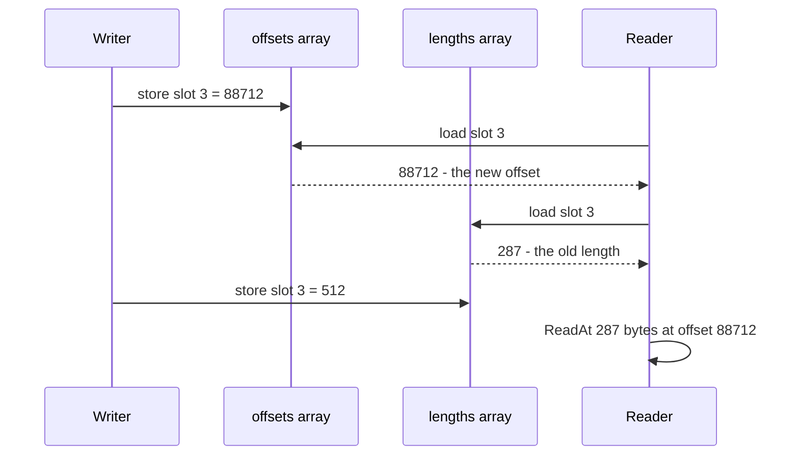
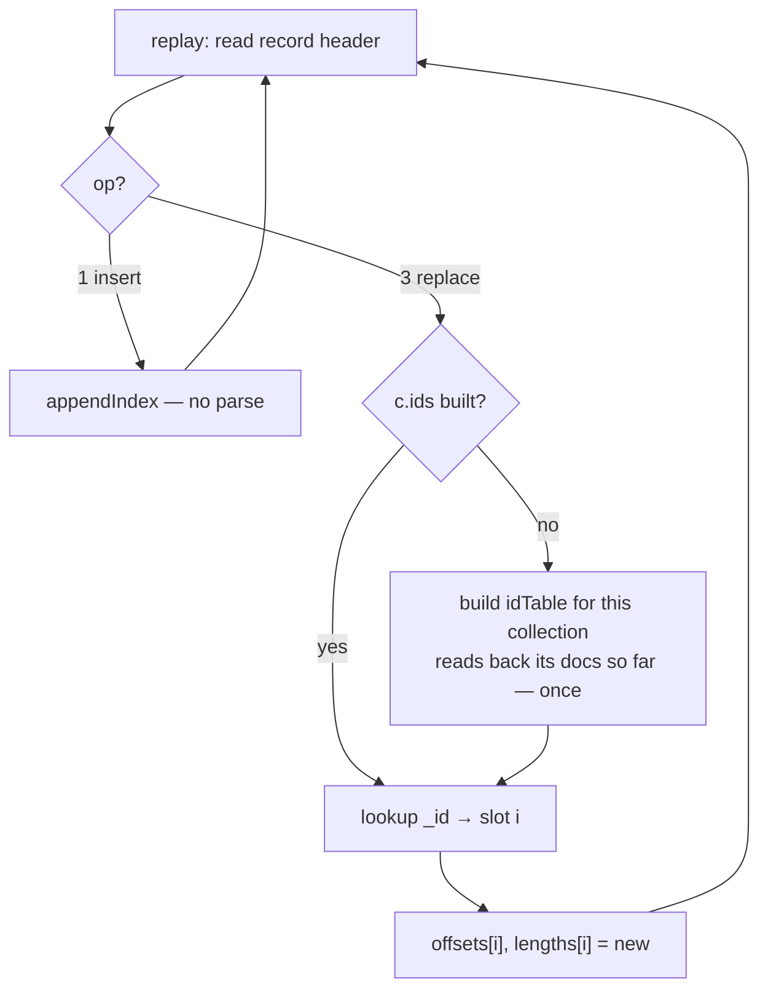

# Updates, deletes, garbage, and compaction

What has to happen for `Update` and `Delete` to exist, written down **before** the code
is written, because two of the decisions here are hard to reverse afterwards.

Companion to [`file-format.md`](file-format.md), which describes the format as it stands
today. Nothing in this document is implemented — it is roadmap items 1 and 2 of
[`design.md`](design.md) §11, worked out far enough to commit to.

---

## 1. The question that starts this

> *What happens if I update a record with a larger payload? Does it get written at the
> end and the old range marked as unused — giving a fragmented file after a while?*

**Larger, smaller, identical — it makes no difference.** This is worth stating first,
because it is the single biggest thing the append-only layout buys and it is easy to
carry a slotted-page intuition into it.

| | slotted-page store (SQLite, Postgres) | append-only log (here) |
|---|---|---|
| update fits in place | rewrite the slot | append |
| update is **larger** | doesn't fit → overflow page, or migrate the row and leave a forwarding pointer | append |
| update is **smaller** | slot keeps its size, internal fragmentation | append |
| code paths | three, plus a free-space map | **one** |

An update is `db.appendRecord(opReplace, c.id, newPayload)` at `db.size`, exactly like an
insert ([`store.go:184`](../store.go#L184)). There is no size class, no free list, no
best-fit search, no page split. That whole family of problems is traded away.

What gets traded *for* it is the subject of the rest of this document.

### Nothing is "marked as unused"

There is nowhere to mark it. The file has no allocation bitmap, no free list, and no
per-record live flag — and a live flag is not an option, because setting one means
**writing in place**, which would break the CRC of an already-written record, break
torn-tail recovery (damage would no longer be only at the tail), and break lock-free
readers all at once.

Instead:

> **A record is dead if, and only if, nothing in the in-memory index points at it.**

The index is the sole authority on liveness, and it is rebuilt from scratch on every
`Open` ([`replay`](../store.go#L307)). The file itself is just bytes in write order.

```
       live                    dead                   live
        │                       │                      │
   +---------+  +---------+  +---------+  +---------+  +---------+
   | ins v1  |  | ins v1  |  | ins v1  |  | rep v2  |  | rep v2  |
   | doc A   |  | doc B   |  | doc C   |  | doc C   |  | doc B   |
   +---------+  +---------+  +---------+  +---------+  +---------+
        ▲            ▲                         ▲            ▲
        │            └────────────┐            │            │
        │                         │  ┌─────────┘            │
   c.offsets = [ A ,              B(new) ,           C(new) ]
                                  └──────────────────────────┘
                       nothing points at the two dead records
```

So yes: the file only ever grows, and garbage accumulates. Update every document *k*
times and the file is (k+1)× the live size. That is ordinary log-structured economics,
it is well understood, and **it is not the hard part.**

---

## 2. The hard part: three invariants this breaks

The difficulty is not space. It is that three separate fast paths in this codebase
quietly assume *a slot's contents never change*.

Everything below is written in terms of update, because that is where each break is
easiest to see. **Delete breaks all three the same way** — removing a slot mutates the
arrays just as re-pointing one does — so §6 inherits this section wholesale rather than
repeating it.

### 2.1 The index immutability rule

[`index.go:63-70`](../index.go#L63-L70) states it outright:

> THE ONE RULE that makes lock-free reads safe: index entries may be appended and the
> backing arrays may be reallocated, but **element i must never be rewritten once
> published.**

An update wants precisely that — `offsets[i]` must move from the old payload to the new
one. And readers scan with **no lock held** ([`snapshot`](../index.go#L96)), sharing the
writer's backing array.

This is not a theoretical race. `offsets` and `lengths` are two *separate* arrays
([`index.go:41-42`](../index.go#L41-L42)), so there is no way to update both as one
operation:

Slot 3 starts as `offset 990, length 287` and is being updated to `offset 88712,
length 512`. The writer sets the two arrays one after the other; a reader lands in
between:



The reader now holds a **new offset with an old length** and reads 287 bytes from a
record that is 512 long: truncated JSON, or — if the lengths went the other way — a read
straddling into whatever follows.

Silent corruption, not a crash. And independently of the mismatch, a concurrent
read/write of the same word with no synchronisation is a data race by the Go memory
model — `go test -race` would flag it even on a 64-bit machine where the store happens to
be atomic in practice.

### 2.2 `scanSequential` stops being correct

[`scan.go:92`](../scan.go#L92) deliberately **ignores the index** and re-derives
membership from the file:

```go
if coll != c.id || op != opInsert {
    r.Discard(int(length))
    continue
}
```

That is valid today only because *"every insert record with this coll id, in file order"*
**is** the collection. Introduce replace records and it is false — the pass would stream
past both the old and the new version of a document with no way to tell which is live.
Resolving it by `_id` means parsing every record and carrying a seen-set, which destroys
the streaming property that justifies the path in the first place.

### 2.3 Offsets stop ascending

Easy to miss, and it has teeth. The replacement lands at the end of the file, so:

```
before:   offsets = [ 44,   522,   990,  1408 ]      ascending
update doc 1:
after:    offsets = [ 44, 88712,   990,  1408 ]      not ascending
```

Two things depended on that ordering:

- [`scanStrided`](../scan.go#L117) advertises *"the offsets ascend, so this is a
  forward-only strided read that the page cache handles well."* It becomes genuine random
  I/O.
- It removes the cheap fix for §2.2 — walking the file and an ascending offset list
  together as a merge, O(1) per record, no hash set.

**This reframes what compaction is for.** It is not primarily space reclamation. It is
what *restores the invariants the fast paths depend on*: contiguity, ascending offsets,
file-order equal to insertion-order, and per-collection locality, all in one pass.

---

## 3. Decision: the record

`op = 3` is already reserved ([`store.go:71`](../store.go#L71)) and a reserved op is a
**hard error** on read ([`store.go:408-412`](../store.go#L408-L412)), so an old binary
meeting an updated file fails loudly instead of silently serving stale documents. No
format change is needed.

**The payload is the complete new document, not a diff.**

| | full document | diff / patch |
|---|---|---|
| record size | full doc every time | small |
| reading a document | one `ReadAt` | base record + every diff since — or a materialised cache |
| replay | position-independent | must apply diffs strictly in order |
| `Update` implementation | `Insert` plus an index fixup | a new subsystem |

The full document wins on everything except bytes written, and bytes-on-disk is exactly
what compaction exists to reclaim. Diffs would trade a solved problem for an unsolved one.

`op = 2` (delete) is the same shape with an `_id`-only payload and **no new index
entry** — which sounds like a footnote and is not. §6 is entirely about what that
sentence hides.

---

## 4. Decision: how the index changes

Three viable shapes. The trade is **cost per update** against **keeping snapshot
semantics**.

| | cost per `Update` **call** | snapshot isolation | complexity |
|---|---|---|---|
| **A.** copy both slices, swap under the write lock | O(n) — 12 MB at 1M docs | preserved | ~10 lines |
| **B.** chunked slices `[][]int64` | O(√n) — see below | preserved | ~60 lines |
| **C.** `[]atomic.Pointer[chunk]`, per-chunk atomic store | O(chunk) | **lost** | ~60 lines + memory-model care |

**Recommendation: A for v2.** Two reasons, and the first is the one that matters:

1. **`Update(filter, update)` is a bulk operation.** It updates every matching document
   in one call, under one write lock, with **one** index rebuild at the end. Updating
   1,000 documents costs one 12 MB copy, not a thousand. The O(n) is per *call*, not per
   document.
2. A 12 MB memcpy is ≈1 ms at typical memory bandwidth. The default durability mode
   already pays an `fsync` per write, which is 0.5–2 ms on an SSD. The copy is *the same
   order of magnitude as a cost the design already accepts.*

It also preserves the immutability rule verbatim rather than weakening it, which is
exactly the escape hatch design.md §4 already reserved:

> Anything that would violate it — in-place compaction, for instance — has to swap in a
> whole new pair of slices under the write lock instead.

The pathological case is a tight loop of single-document `Update` calls. If a benchmark
ever shows that is a real workload, **B** is the answer, and the sizing is worth recording
now so nobody re-derives it:

> cost(c) = 12c (copy one chunk) + 48n/c (copy two outer slices of 24-byte slice headers).
> Minimised at c = 2√n. For n = 1M: c ≈ 2000, cost ≈ 48 KB per update — a 250× improvement
> over A.

**C is listed to be ruled out.** Storing chunk pointers atomically removes the outer copy
entirely, but a reader can then observe chunk 3 updated and chunk 7 not — some documents
at their new version, some at their old, within one scan. That is no longer the
point-in-time view design.md §6 promises as documented behaviour. Not worth it.

> **Go note — this is RCU, and the GC does the hard half.** Read-Copy-Update in C or C++
> needs epoch-based reclamation or hazard pointers to answer *"when is it safe to free the
> old array?"* — that is most of the difficulty. In Go the answer is free: a reader's
> `snapshot` holds a slice header referencing the old array, so the old array is reachable,
> so it simply is not collected until the last reader drops it. No refcount, no epoch, no
> `free`. The same reason [`snapshot`](../index.go#L96) needs no cleanup today.

### The slot is replaced, not appended

An update overwrites index slot `i` rather than appending a new one. Two consequences,
both wanted:

- **Insertion order is preserved.** An updated document stays where it was in an unsorted
  query's results, instead of jumping to the end.
- **`Len()` stays exact** as `len(c.offsets)`, and so does `Count(nil)`, which
  short-circuits to it at [`collection.go:264-266`](../collection.go#L264-L266). That
  settles design.md §12's open question *for updates*; §6.3 settles it for deletes, by
  removing the slot outright rather than tombstoning it.

---

## 5. The cost nobody expects: the idTable stops being optional

Worth flagging harder than fragmentation, because it is a real regression in a headline
number.

Replay today parses **nothing** ([`store.go:365`](../store.go#L365)) — that is why `Open`
is one sequential read plus a CRC pass. But to apply a replace record, replay must know
*which slot it supersedes*, and the only stable answer is the `_id`.

Meanwhile the idTable is deliberately lazy ([`ensureIDTable`](../index.go#L225)) and most
workloads never build it. Making it unconditional would add +24 bytes/doc to the 12 MB
headline figure — a 3× increase — for every database, including ones that never update
anything.

**The compromise:** replay stays parse-free until it meets the **first** `op=2`/`op=3`
record for a given collection. At that moment it builds that collection's idTable by
reading back the documents it has already indexed, then continues with cheap lookups.



- A file that never saw an update pays **nothing** — the property is preserved exactly.
- A collection that has been updated pays one extra read of its own documents, once, at
  open.
- The charge is per *collection*, not per database, so one updated collection does not tax
  the others.

This is the decision that is genuinely awkward to retrofit, which is why it is written
down now rather than discovered during implementation.

---

## 6. Delete

A delete is an append, like everything else:

```go
db.appendRecord(opDelete, c.id, []byte(`{"_id":"ord-1"}`))
```

That is the whole write side. Nothing is erased, nothing is overwritten, the original
`op=1` record stays byte-for-byte where it was. **You add ~27 bytes to the file in order
to remove a document.**

### 6.1 Why write anything at all

The obvious objection, and the thing worth getting straight first: if `Delete` just drops
the index slot in memory, why touch the file?

Because **memory is derived state, rebuilt from the file on every `Open`**
([`replay`](../store.go#L307)). Drop the slot in memory only, restart, and replay walks
the file, finds the original insert record, and the document comes back:

```
file:     [ ins A ] [ ins B ] [ ins C ]
index:      slot0     slot1     slot2

  Delete B  ->  drop slot1 from the index only

index:      slot0     slot1(C)

  restart   ->  replay reads the file

index:      slot0     slot1     slot2        <- B is back
```

So the tombstone is **a message to future replays, not to queries.** No running query
ever reads an `op=2` record; the scan skips it on the `op != opInsert` test that already
exists at [`scan.go:92`](../scan.go#L92). Its entire job is to make replay reproduce the
deletion — it turns *"the index forgot"* into *"the file records that it was forgotten."*

### 6.2 What "no new index entry" means

The contrast with the other two operations is the point:

| | record appended | payload | index afterwards | `Len()` |
|---|---|---|---|---|
| **insert** | `op=1` | full document | **+1 slot**, pointing at the new record | +1 |
| **update** | `op=3` | full document | same count; slot `i` **re-pointed** at the new record | unchanged |
| **delete** | `op=2` | just the `_id` | **−1 slot**; *nothing points at the tombstone* | −1 |

An update's record is a live document, so something must point at it. A delete's record
is not a document at all — it is a marker, unreferenced from the moment it is written.

That is also why the payload is only the `_id`: nobody will ever read this record to
answer a query. Replay needs exactly one thing from it — *which* document died.

### 6.3 The slot, and a trap in the idTable

Two options for the in-memory slot:

| | cost | `Len()` | notes |
|---|---|---|---|
| **remove the slot** — `append(offsets[:i], offsets[i+1:]...)` | O(n) shift | stays `len(offsets)` | free: §4 already copies both arrays per call |
| **tombstone the slot** — `lengths[i] = 0` | O(1) | needs a separate live counter | dead slots hold 12 B of RAM each until compaction |

**Removing wins**, because §4 already commits to full copy-on-write of both arrays per
call, so the shift rides along at zero marginal cost. `Len()` stays exactly
`len(c.offsets)` and `Count(nil)` keeps its O(1) short-circuit at
[`collection.go:264-266`](../collection.go#L264-L266). That *resolves* design.md §12's
open question rather than deepening it.

**But removing slot `i` shifts every later slot down by one**, and the idTable's
`positions` array holds slot numbers ([`index.go:130`](../index.go#L130)). Every entry
`> i` is now wrong.

And the obvious repair — clearing that id's slot in the table — is a bug. The table is
open-addressed with linear probing, and `forEachCandidate` terminates on a zero
fingerprint ([`index.go:191`](../index.go#L191)):

```go
for t.fingerprints[i] != 0 {
```

Zero a slot in the middle of a probe chain and every entry *behind* it becomes
unreachable. Classic linear-probing deletion hazard, and note there is no spare sentinel
value to use instead: [`fingerprint`](../index.go#L153) already folds `0` to `1`, so `1`
is a legitimate fingerprint.

> **Decision: deletes rebuild the idTable from scratch**, alongside the COW rebuild of
> `offsets`/`lengths`. No in-place table deletion, no sentinel, no probe-chain repair, and
> it costs nothing extra because the arrays are being rebuilt anyway.

### 6.4 Replay: mark, then compact once

Applying deletes *during* the replay walk means slot numbers shift mid-walk, while the
idTable being used to resolve `_id`s is indexed by slot number. Fiddly, and easy to get
subtly wrong.

Two phases instead:

```
pass 1 — the existing walk:
    op=1  ->  append slot                        (no parse, exactly as today)
    op=3  ->  resolve _id -> i, re-point slot i
    op=2  ->  resolve _id -> i, set lengths[i] = 0     <- mark, do not remove
              and drop the _id from the idTable

once, at the end of replay:
    compact out every zero-length slot
    rebuild the idTable
```

Nothing shifts during the walk, so positions stay valid throughout, and the end-of-replay
cleanup is a single O(n) pass. The `_id` resolution uses the same lazy-build-on-first-
`op=2`/`op=3` rule as §5 — a database that never deletes still replays without parsing a
single document.

### 6.5 Delete, then re-insert the same `_id`

Worth tracing, because it shows where the meaning actually lives:

```
op=1  {"_id":"ord-1", v:1}    ->  slot 0, idTable[ord-1] = 0
op=2  {"_id":"ord-1"}         ->  mark slot 0 dead, remove ord-1 from the idTable
op=1  {"_id":"ord-1", v:2}    ->  slot 1, idTable[ord-1] = 1     <- no duplicate error
```

The final insert does not trip `ErrDuplicateID`
([`collection.go:150-158`](../collection.go#L150-L158)) precisely because the tombstone
removed the idTable entry. **Later record wins, always** — and that is guaranteed by
there being exactly one append point for the whole database, so every record has an
unambiguous position in one global order.

### 6.6 Crash safety

A delete has exactly three crash windows, and all three land somewhere correct:

| crash point | on disk | after `Open` | correct? |
|---|---|---|---|
| before any tombstone bytes | nothing | document alive | yes — `Delete` never returned |
| **mid-write** of the tombstone | torn record at the tail | truncated away, document alive | yes — `Delete` never returned |
| after tombstone written and `fsync`ed | complete tombstone | document gone | yes — `Delete` returned success |

There is no fourth case. **There is no state in which the database is half-deleted** —
that is atomicity, and it is inherited wholesale from the append path rather than being a
separate safety story for delete.

The value of this shows up by contrast. An *in-place* delete — zeroing the record, or
flipping a "live" bit in its 12-byte header — that crashes halfway leaves a record whose
bytes no longer match its `crc32`, **in the middle of the file**, which hits
[`store.go:382`](../store.go#L382): `ErrCorrupt`, refuse to open. The failure mode is not
"lost one document", it is "the database will not open at all". Appending keeps the
invariant that **damage can only ever be at the tail**, which is what makes recovery a
two-line rule instead of a repair algorithm.

Two limits to state plainly:

- **Single-record atomicity only.** `Delete(filter)` matching 100 documents writes 100
  tombstones; a crash can leave a prefix applied — 60 gone, 40 alive. The same
  non-guarantee as `InsertMany` ([`store.go:221`](../store.go#L221)). All-or-nothing needs
  the reserved `op=5`/`op=6` pair.
- **Atomic is not durable.** Under `SyncNever` a `Delete` that returned success can still
  vanish in a crash and the document comes back. Not a bug — the mode's documented trade,
  which is why design.md §6 keeps the two properties in separate rows.

The one ordering rule implementation must honour: **drop the in-memory slot only after
the append succeeds**, mirroring [`collection.go:167-169`](../collection.go#L167-L169) —
*"a reader must never see an index entry pointing at a record that was not written."*
Inverted for delete: a reader must never stop seeing a document whose tombstone failed to
write.

### 6.7 Deleting makes the file bigger

The counterintuitive part, and the one to say out loud:

**Until you compact, a delete costs the tombstone *plus* the original document's bytes,
which are still sitting there.** `Delete` is a write amplifier, not a space reclaimer.

Compaction is what collects. It walks the *live* index, so both the dead `op=1` record and
the `op=2` tombstone that killed it are simply never copied to the new file. A deleted
300-byte document costs ~340 bytes until the next `Compact()`, then zero — and this is
why a compacted file contains no `op=2` records at all and reopens on the parse-free
replay path of §5.

---

## 7. Compaction

### What it is for

Restated from §2.3, because it is the thing most likely to be mis-scoped: compaction
reclaims space **and** restores four invariants.

| restored | consequence |
|---|---|
| no dead records | file size back to live size |
| offsets ascend again | `scanStrided` is forward-only again |
| file order == insertion order | `scanSequential` becomes usable again |
| records regrouped per collection | interleaving penalty from `file-format.md` §4 goes away |

### How

Write a new file, then rename. Never in place — in-place compaction would violate every
rule this design rests on.

```
1. take the write lock
2. create <path>.compact
3. write a fresh 32-byte file header
4. for each collection:
     write its define-collection record
     walk its live index in order, copy each live payload as a fresh op=1 insert
     build the new offsets/lengths as you go
5. fsync the new file
6. rename <path>.compact -> <path>          (atomic on POSIX)
7. swap in the new *os.File and the new index arrays; db.dead = 0
8. release the lock
```

Step 4 is why compaction is cheap to write: it is `WalkFile` plus `appendRecord`, both of
which already exist. Note it rewrites replaces as plain inserts, so a compacted file
contains no `op=3` records at all and reopens on the parse-free replay path of §5.

### The gotcha worth designing for now

**In-flight readers hold offsets into the old file.** A scan runs with no lock held, for
possibly seconds, using `snap.offsets` — which after step 7 describe a file that no longer
exists at that path.

Today [`snapshot`](../index.go#L84-L89) captures offsets, lengths, size and total, but
**not the `*os.File`**. It reaches through `c.db.file` at scan time
([`scan.go:135`](../scan.go#L135)), which after the swap is the *new* file. Old offsets,
new file — reads land on arbitrary record boundaries.

The fix is one field: `snapshot` captures the `*os.File` too, and scans use `snap.file`.
Cheap now, invasive later, and it must be decided before compaction ships.

That is sufficient **on Unix**: `rename(2)` over a path whose old inode is still open
keeps that inode alive until the last descriptor closes, so in-flight readers finish
against the old bytes and the space is reclaimed when they do. Go's GC does not close
files, so the old `*os.File` must be closed explicitly once no snapshot references it —
which is the one place refcounting is genuinely needed.

**On Windows this does not work.** Renaming over a file that is still open fails, and the
`.dll` is a first-class target (design.md §8). Options: keep the new file under a
generation-suffixed name and never rename; or block compaction until in-flight scans
drain. Unresolved, and it is the reason compaction is not a one-afternoon task.

### When

**Manual `Compact()` only.** No background goroutine, no policy, no tuning knobs. It is
one exported method the caller schedules.

To make it *actionable*, add one field to `DB`:

```go
dead int64  // bytes superseded by later records; reset by Compact
```

Incremented by `recordHeaderSize + lengths[i]` each time a slot is superseded. One
integer, no allocation, and it is what lets `nsq stat` print

```
demo.nsq  312 MB   1,000,000 docs   47% dead   — consider `nsq compact`
```

instead of leaving you to guess. Automatic compaction is a threshold on `dead/size` once
there are real numbers to set it from; the counter has to exist either way.

---

## 8. The plan

Ordered so each step is independently shippable:

| # | step | touches |
|---|---|---|
| 1 | `snapshot` captures the `*os.File`; scans use `snap.file` | `index.go`, `scan.go` |
| 2 | `db.dead` counter + `nsq stat` reporting | `nosqlite.go`, `cmd/nsq` |
| 3 | per-collection `dirty` flag; set on first update **or delete**, disables `scanSequential`, cleared by `Compact` | `index.go`, `scan.go` |
| 4 | `op=3` write path: `Update` = encode + `appendRecord` + full COW index swap | `collection.go`, `index.go` |
| 5 | replay applies `op=3`, building the idTable on first encounter (§5) | `store.go`, `index.go` |
| 6 | `op=2` write path: `Delete` = tombstone + slot removal + idTable rebuild (§6.3) | `collection.go`, `index.go` |
| 7 | replay applies `op=2` by mark-then-compact (§6.4) | `store.go`, `index.go` |
| 8 | `Compact()` — write-new-and-rename, Unix first | new `compact.go` |
| 9 | Windows compaction story | `compact.go` |

Step 3 is the one that looks optional and is not: without it, steps 4 and 6 ship a
silently wrong `scanSequential` (§2.2). A `dirty` flag is a blunt instrument — it disables
the fast path for the whole collection after a single update — but it is one bool and one
branch, it fails in the safe direction, and `Compact()` clears it. Anything cleverer can
come after a benchmark says it is needed.

Steps 6 and 7 are deliberately separate. The write path can be built and unit-tested
against a live process before replay knows how to reconstruct a deletion; getting them in
one commit means debugging both halves at once.

---

## 9. Open questions

- **Should `Update` be filter-based (`Update(filter, update) (int, error)`) or by id
  (`UpdateOne(id, doc) error`)?** The filter form matches Mongo and makes the O(n) index
  copy amortise properly (§4). The id form is trivially cheap but pushes the read-modify-
  write loop onto the caller, where it will be done wrong. Current lean: **both**, with
  `UpdateOne` as the primitive and `Update` batching over it under one lock.
- **Does `Update` accept operators (`$set`, `$inc`) or whole documents only?** Whole
  documents are simpler and match "the record payload is the full document" (§3).
  Operators are a second expression language to compile and test. Current lean: whole
  documents in the first cut; `$set` immediately after, since replace-the-whole-document
  makes concurrent updates lose data in a way `$set` does not.
- **Does `Compact()` need to be interruptible?** Compacting a 300 GB file is minutes of
  held write lock. A generational/incremental compactor is a much larger design; the
  honest v2 answer may be "document that it blocks writes for the duration."
- **Should `nsq compact` exist as a CLI verb** so a database can be compacted without the
  owning process? It is the same code pointed at a closed file, and it composes with
  `nsq stat`'s dead-byte report.
- ~~**What does a delete do to `offsets`?**~~ **Resolved in §6.3:** the slot is removed,
  riding along with the COW copy §4 already performs, and the idTable is rebuilt rather
  than edited in place. `Len()` stays `len(offsets)`.
- **Should deleting a non-existent `_id` write a tombstone?** Writing one is garbage that
  compaction must later collect, for a delete that deleted nothing. Not writing one means
  `Delete` needs the idTable built just to answer "does this exist", which is the expensive
  path for a no-op. Current lean: **resolve first, write nothing if absent**, and return a
  count of 0 — the idTable is needed for the delete itself anyway.
- **Does `Delete` need a `DeleteMany` distinction?** Mongo separates `deleteOne` and
  `deleteMany` so that a filter matching more than intended cannot quietly wipe a
  collection. Current lean: follow Mongo, since `Delete(filter)` with a typo'd filter is
  the one mistake in this API with no undo.

---

## See also

- [`file-format.md`](file-format.md) — the format as it is today, and §7's reserved
  extension points
- [`design.md`](design.md) §4 (the immutability rule), §11 (roadmap), §12 (open questions)
